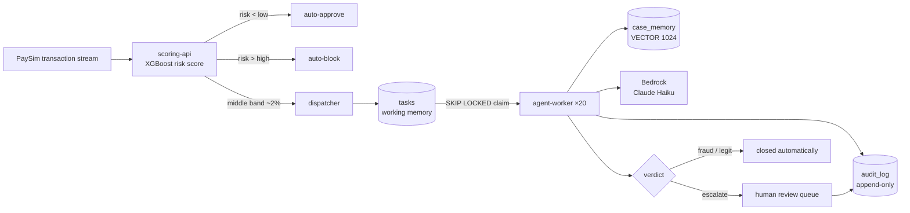
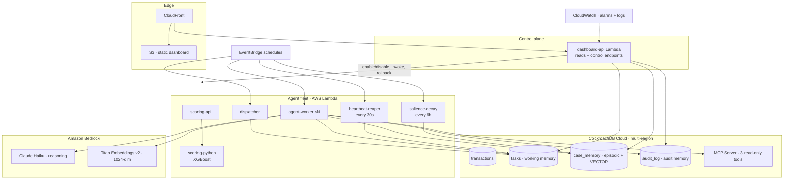
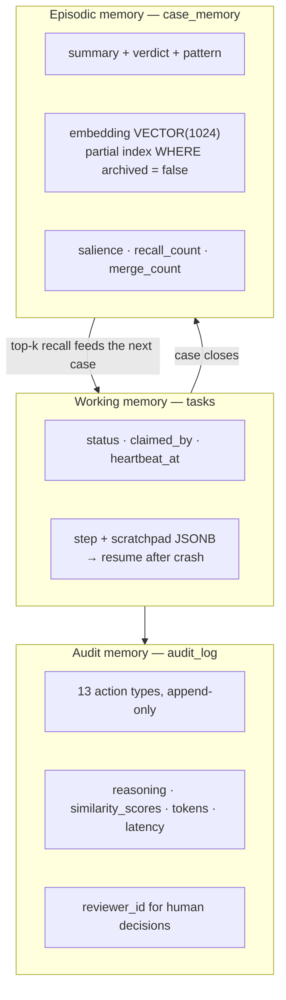
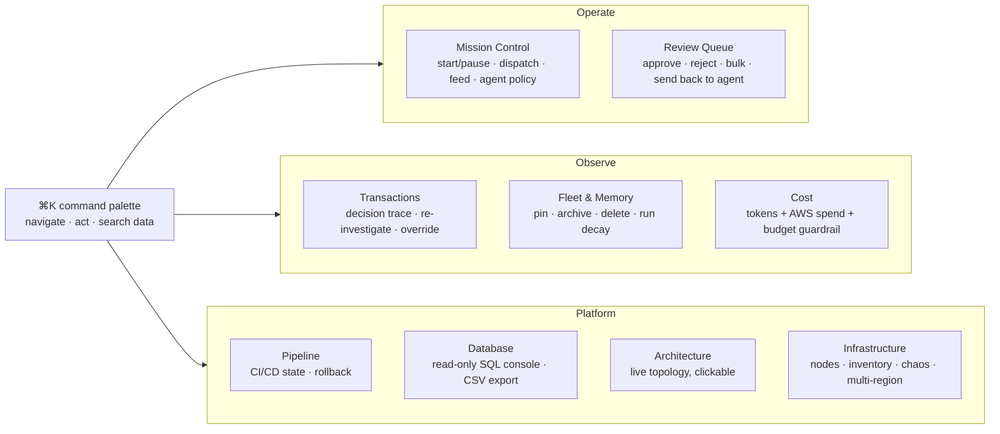
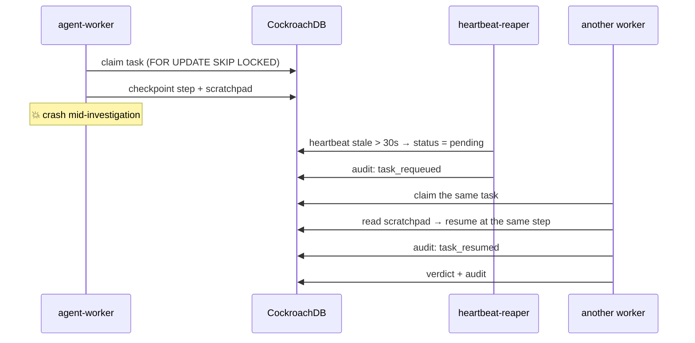

# HiveMind — Distributed Memory & Control Platform for Production Agent Fleets

[](https://github.com/lethingochan27925/hivemind/actions/workflows/ci.yml)
[](https://github.com/lethingochan27925/hivemind/actions/workflows/security.yml)
[](LICENSE)

> **Hackathon:** CockroachDB × AWS — Build with Agentic Memory
> **Submission details:** [`SUBMISSION.md`](SUBMISSION.md) · **Docs:** [`docs/`](docs/) · **Tests:** [`test/`](test/)

**One line:** HiveMind is the memory layer *and the control platform* for a fleet of AI agents in production — the agents survive crashes and region failures because their state lives in CockroachDB, and a human can watch, tune, and override every part of the system from one console.

To prove it under the harshest conditions, the demo workload is **fraud investigation** on PaySim payments: losing state means losing money, and every decision must be auditable.

---

## 1. What it actually does



A cheap classifier sweeps every transaction. Only the ~2% it cannot clear reach the agent fleet. Each agent claims a case, **recalls similar past cases from shared memory**, reasons with Claude Haiku over a deterministic balance-reconciliation signal, and returns `fraud` / `legit` / `escalate` — writing an append-only audit row at every step.

**Measured on the live system** (`go run ./cmd/eval --api <url>` — no credentials needed, anyone can re-run it):

| | |
|---|---|
| Fraud recall / precision / F1 | **100% / 100% / 100%** (34 caught, 0 false alarms, 0 missed) |
| Evidence alignment | **100% of traceable-money cases decided autonomously · 100% of untraceable ones escalated** — verdicts track evidence, never vibes |
| Auto-resolved without a human | **46%** — the rest the agent escalates on purpose |
| Verdicts from real reasoning | **94.3%** model decisions vs 5.7% rule-based fallback (recorded separately, never disguised) |
| Cost | **$0.00023 per investigation** ≈ $0.11 per 500-case run |
| Fleet integrity | **0 double claims**, 3,201 tasks resumed from checkpoint after a crash |
| Memory reuse | 115 consolidated memories absorbing **3,873 raw cases** (~34:1) |
| **Verdict stability under memory change** | **0.0 points** — same 60 cases, empty memory vs full memory, identical outcomes |

That last row is the one to read twice: recalled text never overrides the arithmetic evidence.
See [`docs/EVALUATION.md`](docs/EVALUATION.md) for the controlled A/B behind it.

---

## Commands

Every routine is one `make` target; run `make` for the full list.

```bash
make init                     # build the whole stack from zero
make check                    # build + vet + test + pipeline invariants
make ship                     # check, then deploy backend and dashboard
make start && make feed N=200 # run the fleet against 200 cases
make scorecard                # regenerate evidence/SCORECARD.md from the live system
```

See [docs/WORKFLOWS.md](docs/WORKFLOWS.md) for every situation.

## 2. Architecture



Full detail: [`docs/ARCHITECTURE.md`](docs/ARCHITECTURE.md). The **Architecture** page in the dashboard renders this same topology *from the live AWS inventory* — every node there is a real resource, not a drawing.

---

## 3. Three tiers of memory (the heart of the project)



| Tier | Table | Job | Lifetime |
|------|-------|-----|----------|
| Working | `tasks` | Coordinate the fleet, survive crashes | seconds–minutes |
| Episodic | `case_memory` | Learn from past cases (vector recall) | days–weeks, decayed by salience |
| Audit | `audit_log` | Legal-grade evidence of every decision | forever |

The episodic tier has two independent lifecycles — **construction** (summarise → embed → consolidate, merging above 0.92 similarity) and **query** (SQL pre-filter → vector top-k → reinforce recalled memories) — plus **forgetting** (salience decay, then archive out of the partial vector index). Depth: [`docs/AGENTIC_MEMORY.md`](docs/AGENTIC_MEMORY.md).

---

## 4. The control platform

Not a dashboard that watches — a console that **operates**. Ten pages, bilingual (EN/VI), light/dark, every panel drag-resizable, everything reachable from `Ctrl+K`.



Highlights:

- **Agent policy, live.** Move the auto-approve / auto-block thresholds, fan-out, and model-failure behaviour while the fleet runs — the agent re-reads them every task, no deploy.
- **Decision trace.** Open any transaction and see the anatomy of the verdict: which memories were recalled *with their real vector similarity*, what the model was told, what it cost, and any crash/resume.
- **Chaos button + recovery tracker.** Kill an agent and watch *killed → reaper re-queued (+Xs) → resumed from checkpoint (+Ys)*.
- **Memory administration.** Pin a case so decay can never forget it, archive one out of the vector index, or run the decay job on demand.
- **Guardrails that act.** A daily Bedrock cap that disables the fleet's schedules when crossed; a read-only SQL console that rejects every mutating statement server-side.

Full reference: [`docs/CONTROL_PLANE.md`](docs/CONTROL_PLANE.md) · API: [`docs/API.md`](docs/API.md).

---

## 5. Resilience



| Failure | Mechanism | Guarantee |
|---------|-----------|-----------|
| Two agents grab one task | `SELECT … FOR UPDATE SKIP LOCKED` + `UNIQUE(transaction_id)` | Exactly-once investigation |
| An agent dies mid-case | `heartbeat_at` + reaper + `scratchpad` | Resumes at the same step in ≤30s |
| A region goes down | CockroachDB multi-region consensus | Writes continue, **RPO = 0** |
| Bedrock unavailable | Adaptive retry, then policy: escalate **or** re-queue | No silent bad verdicts, no human flood |
| A bad deploy | Canary + auto-rollback, plus one-click manual rollback | Previous version restored |

---

## 6. Quick start

**Prerequisites:** AWS account with Bedrock access (Claude Haiku in `ap-southeast-1`, Titan Embeddings in `us-east-1`), a CockroachDB Cloud cluster, Terraform ≥ 1.5, Docker, Go 1.25, Node 22.

```bash
git clone https://github.com/lethingochan27925/hivemind && cd hivemind
cp .env.example .env         # fill in CockroachDB + AWS values
./scripts/init.sh            # stands up EVERYTHING from zero
```

`init.sh` runs Terraform, builds and pushes all seven container images, publishes each Lambda and moves its `live` alias, loads the schema, seeds PaySim, builds and deploys the dashboard, and pushes the GitHub Actions secrets.

Day-to-day (no need to re-run `init.sh`):

```bash
./scripts/deploy-lambda.sh agent-worker dashboard-api   # ship Go changes
./scripts/deploy-dashboard.sh                           # ship UI changes
./scripts/multi-region.sh status                        # inspect DB regions
./scripts/capture-evidence.sh                           # snapshot proof into evidence/
```

Every script resolves account, region, bucket, distribution and URLs **dynamically** — recreating the infrastructure never breaks them. Runbook: [`docs/DEPLOYMENT.md`](docs/DEPLOYMENT.md).

---

## 7. Verify it yourself

```bash
go test ./...                                   # hermetic: no AWS, no DB
bash test/integration/pipeline_test.sh          # CI/CD invariants
bash test/integration/api_smoke.sh "$(terraform -chdir=terraform output -raw dashboard_api_url)"
```

The suite covers the discriminator behind the accuracy claim, prompt-injection defence, routing thresholds, vector encoding, crash-resume serialization, and **every mutating control endpoint driven with a nil database** — so a removed validation guard fails loudly instead of letting a bad mutation through. Plan and cases: [`test/`](test/).

---

## 8. Documentation map

| Document | Answers |
|----------|---------|
| [`docs/ARCHITECTURE.md`](docs/ARCHITECTURE.md) | Components, end-to-end flow, resilience model |
| [`docs/AGENTIC_MEMORY.md`](docs/AGENTIC_MEMORY.md) | Why this is a production memory layer, not a toy query |
| [`docs/DATA_MODEL.md`](docs/DATA_MODEL.md) | The real schema, every index and why it exists |
| [`docs/AGENT_REASONING.md`](docs/AGENT_REASONING.md) | How a small model reaches correct verdicts |
| [`docs/CONTROL_PLANE.md`](docs/CONTROL_PLANE.md) | Every control surface and the safety model behind it |
| [`docs/API.md`](docs/API.md) | All endpoints with `curl` examples |
| [`docs/CICD.md`](docs/CICD.md) | The 8-workflow pipeline, canary and auto-rollback |
| [`docs/DEPLOYMENT.md`](docs/DEPLOYMENT.md) | Zero-to-running runbook + known failure modes |
| [`docs/SECURITY.md`](docs/SECURITY.md) | IAM, secrets, prompt injection, read-only guards |
| [`docs/adr/`](docs/adr/) | The load-bearing decisions, one file each |

---

## 9. Scope boundaries (deliberate)

Out of scope for this milestone, and documented as roadmap rather than hidden: end-user authentication/RBAC for the console, multi-tenancy, payment-gateway integration, and automated Bedrock circuit-breaking beyond the daily budget guardrail. The control plane ships with an optional shared-token gate (`CONTROL_TOKEN`); a real deployment would put SSO in front of it.

## 10. Credits & license

PaySim synthetic financial dataset (Kaggle, CC BY 4.0). Built on CockroachDB Cloud, Amazon Bedrock, and AWS Lambda. Licensed under [Apache 2.0](LICENSE).
