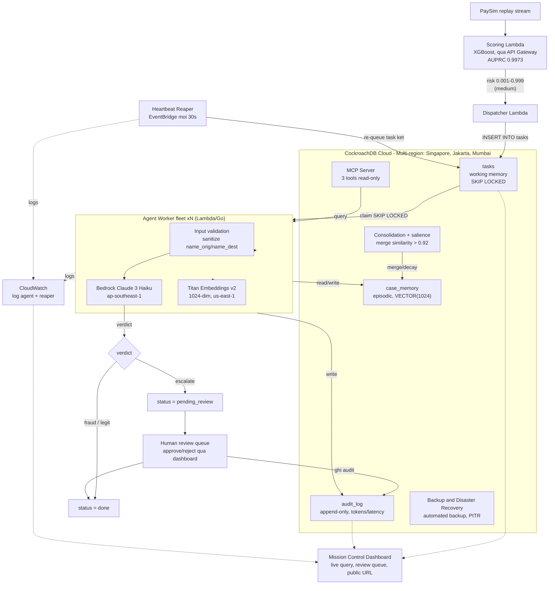
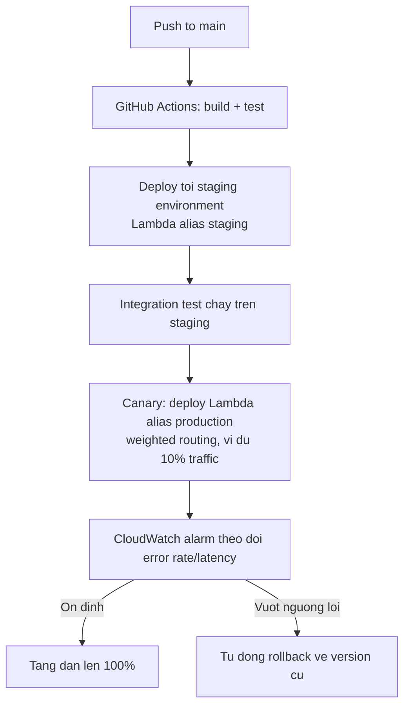

# HiveMind — Distributed Memory & Control Plane for Production Agent Fleets

[](https://github.com/lethingochan27925/hivemind/actions/workflows/ci.yml)
[](https://github.com/lethingochan27925/hivemind/actions/workflows/security.yml)
[](LICENSE)

> **Hackathon:** CockroachDB x AWS — Build with Agentic Memory
> **Deadline:** 18/08/2026, 5:00 PM ET
> **Giai thuong:** $8,750 USD (1st: $5,000, 2nd: $2,500, 3rd: $1,250)
> **Tham gia:** 559 participants
>
> **Pitch mot cau:** HiveMind la control plane va lop memory phan tan (CockroachDB) cho agent fleets trong production — song sot qua agent crash lan region failure, co governance, telemetry va quy trinh phe duyet con nguoi day du. De chung minh no chiu duoc workload khat khe nhat, chung toi van hanh mot fleet agents dieu tra gian lan thanh toan tren du lieu PaySim, noi mat state la mat tien va moi quyet dinh phai audit duoc.

---

## 0. Trang thai tai lieu

Day la scope v3 — ban thong nhat cuoi cung giua kien truc thuc te trong code (`github.com/lethingochan27925/hivemind`) va dinh huong san pham. Version nay thay the toan bo cac ban truoc, bao gom:

- Sua dataset: IEEE-CIS sang PaySim (ly do license, xem muc 4)
- Sua compute: EKS/Kubernetes sang AWS Lambda
- Thong nhat bang episodic memory: chi dung `case_memory`, bo `episodic_memory`
- Bo sung 4 hang muc production-readiness: Backup/DR, CI/CD day du, Input validation, Human-in-the-loop

---

## 1. Bai toan va Gia tri doanh nghiep

### Bai toan: van hanh agent fleet trong production

Doanh nghiep dang chuyen tu "mot chatbot" sang "nhieu agents chay tu dong trong quy trinh that". Ngay khi fleet vuot qua vai agents, ba van de ha tang xuat hien — va chua co lop chuan nao giai quyet:

1. **Memory khong duoc phep chet** — agent dang giu trang thai nghiep vu (dang hold giao dich cua khach) ma mat state nghia la tien treo, viec bo do, hoac hanh dong bi lap lai.
2. **Nhieu agents chay song song** — can co che claim task khong trung lap, chia se kinh nghiem giua cac agents, va khong giam chan nhau khi ghi state lien tuc.
3. **Khong ai nhin thay fleet dang lam gi** — thieu audit trail (compliance), cost tracking, latency telemetry cho tung agent, va khong co diem dung de con nguoi can thiep khi agent khong chac chan.

**Khach hang muc tieu:** Platform Engineering / CTO cua cac doanh nghiep dang dua agents vao production.

### Workload chung minh: fraud investigation

Fraud duoc chon co chu dich vi no ep control plane the hien moi nang luc cot loi:

- Mat state la mat tien that, bat buoc durable working memory.
- Pattern gian lan lap lai, episodic memory chung cua fleet tao gia tri do duoc.
- Nganh tai chinh doi hoi audit trail phap ly, audit memory la dieu kien ton tai.
- Khong ngan hang nao de AI tu quyet dinh "fraud" ma khong co buoc nguoi duyet cho case mo ho, human-in-the-loop la dieu kien ton tai, khong phai tinh nang phu.
- Dung nganh trong diem cua CockroachDB (fintech: strong consistency, compliance, zero downtime).

**Tai sao khong train ML model rieng:** Agent cua HiveMind la investigator, khong phai classifier. Fraud detection co hai tang: tang scoring (ML model, quet hang trieu giao dich moi giay, re) va tang investigation (agent, xu ly case da bi flag, dat nhung can reasoning). HiveMind la tang hai. Voi case ma chinh agent cung khong chac (`escalate`), co them tang ba: con nguoi phe duyet — dung voi cach nganh tai chinh van hanh that.

### Gia tri

- **Cho doanh nghiep van hanh agents:** mot lop memory va governance dung chung, thay vi moi team tu che Redis + vector DB + Postgres roi rac.
- **Cho nghiep vu demo (fraud):** giam thoi gian dieu tra — so lieu that do tu eval 200 case, khong phai uoc luong (xem muc 11, Definition of Done).
- **Cho compliance:** moi quyet dinh cua agent truy vet duoc bang mot cau SQL; case rui ro cao luon co dau vet nguoi duyet.

---

## 2. Dap ung yeu cau cuoc thi (Compliance Matrix)

Nguon: trang Devpost chinh thuc. Yeu cau toi thieu la 2/4 cong cu CockroachDB va 1 dich vu AWS. HiveMind chu dong vuot muc toi thieu vi day la diem cham o tieu chi Technical Implementation, khong phai vi bat buoc.

| Yeu cau                                                | Cach dap ung                                                                                                               | Bat buoc                                             |
| ------------------------------------------------------ | -------------------------------------------------------------------------------------------------------------------------- | ---------------------------------------------------- |
| CockroachDB lam persistent memory layer                | 3 tang memory: episodic (`case_memory`, vector + text), working (`tasks`, transactional), audit (`audit_log`, append-only) | Co                                                   |
| Toi thieu 2 cong cu CockroachDB                        | MCP Server (3 tools read-only), Distributed Vector Indexing (`case_memory`, multi-region)                                  | Co — da dat                                          |
| Toi thieu 1 dich vu AWS                                | Bedrock (Claude 3 Haiku reasoning + Titan Embeddings v2), Lambda (toan bo compute)                                         | Co — da dat                                          |
| Repo public, open source                               | GitHub public, license Apache 2.0, README + setup day du                                                                   | Co                                                   |
| Demo app URL hoat dong                                 | Dashboard deploy public URL, doc live tu CockroachDB                                                                       | Co — yeu cau nop bai chinh thuc, khong phai optional |
| Video demo                                             | Duoi 3 phut, YouTube hoac Vimeo public, the hien ro CockroachDB memory layer dang hoat dong                                | Co                                                   |
| Xac dinh ro tool CockroachDB da dung va dung de lam gi | Viet trong `SUBMISSION.md`                                                                                                 | Co                                                   |
| Xac dinh ro dich vu AWS da dung va dung de lam gi      | Viet trong `SUBMISSION.md`                                                                                                 | Co                                                   |
| Architecture diagram                                   | Mermaid trong README                                                                                                       | Khong bat buoc, nen lam                              |
| Feedback ve CockroachDB AI tools                       | Ghi trong `SUBMISSION.md`                                                                                                  | Khong bat buoc                                       |

### Tieu chi cham diem chinh thuc

1. **Agentic Memory Design** — CockroachDB co vai tro production-grade that khong, hay chi toy query?
2. **Technical Implementation** — Tich hop MCP, vector index, ccloud CLI co chat luong, dung va an toan khong?
3. **Real-World Impact** — Use case co y nghia that, co so lieu chung minh khong?
4. **Production Readiness** — Co an toan, quan sat duoc, scale duoc, nghi den resilience va access control khong?
5. **Creativity & Originality** — Co insight that ve su khac biet cua he agentic so voi ung dung truyen thong khong?

---

## 3. Kien truc tong the

### 3.1 So do luong chinh



### 3.2 Thanh phan

| Thanh phan       | Cong nghe                                             | Vai tro                                                                              |
| ---------------- | ----------------------------------------------------- | ------------------------------------------------------------------------------------ |
| Data Stream      | PaySim (Kaggle, CC BY 4.0), controlled replay script  | Nguon giao dich tong hop, phan phoi thong ke that                                    |
| Scoring          | Lambda (Python/Go) + API Gateway                      | XGBoost fraud scorer, routing theo risk_tier                                         |
| Dispatcher       | Lambda                                                | Nhan transaction medium-tier, ghi task vao working memory                            |
| Agent Worker     | Lambda xN (Python dev spec sau do port Go production) | Claim, input validation, MCP query, vector recall, Bedrock reasoning, verdict, audit |
| Memory Layer     | CockroachDB Cloud, multi-region                       | 3 tang: working (`tasks`), episodic (`case_memory`), audit (`audit_log`)             |
| Reasoning        | Amazon Bedrock, Claude 3 Haiku                        | Phan tich case, sinh lap luan ngon ngu tu nhien                                      |
| Embeddings       | Amazon Bedrock, Titan Embeddings v2                   | Vector hoa case summary, 1024 chieu co dinh                                          |
| MCP              | CockroachDB Managed MCP Server                        | Agent tu query customer context (read-only)                                          |
| Human review     | Dashboard panel, `tasks.status = pending_review`      | Nguoi duyet case verdict escalate                                                    |
| Heartbeat Reaper | EventBridge Scheduled Rule goi Lambda, moi 30s        | Re-queue task bi stuck                                                               |
| Observability    | CloudWatch                                            | Log Agent Worker + Reaper, phuc vu Production Readiness                              |
| Backup/DR        | CockroachDB Cloud automated backups + PITR            | RTO/RPO documented cho 3 kich ban su co                                              |
| Dashboard        | Next.js + React + shadcn/ui                           | Fleet status, cost/latency, audit trail, review queue                                |
| IaC              | Terraform + ccloud CLI                                | Toan bo AWS + CockroachDB cluster tu zero                                            |
| CI/CD            | GitHub Actions                                        | Staging rieng, canary deployment, rollback tu dong                                   |
| Security         | IAM least-privilege, Secrets Manager                  | Moi Lambda chi co quyen toi thieu; DB user rieng cho agent                           |

---

## 4. Nguon du lieu va Chien luoc Data

### 4.1 Tai sao dung PaySim thay vi IEEE-CIS

PaySim Synthetic Financial Dataset (Kaggle, `ealaxi/paysim1`) duoc chon thay IEEE-CIS vi ly do license: IEEE-CIS khong tuong thich voi cuoc thi co giai thuong tien mat. PaySim license CC BY 4.0, dung duoc cho muc dich thuong mai/hackathon.

| Truong PaySim                      | Y nghia                                    | Agent dung de                 |
| ---------------------------------- | ------------------------------------------ | ----------------------------- |
| `step`                             | Gio trong simulation (1 den 743)           | Xac dinh thoi diem bat thuong |
| `type`                             | TRANSFER hoac CASH_OUT (2 loai co fraud)   | Phan loai pattern             |
| `amount`                           | So tien giao dich                          | Amount pattern                |
| `oldBalanceOrig`, `newBalanceOrig` | So du tai khoan goc truoc/sau              | Tinh loi so du                |
| `oldBalanceDest`, `newBalanceDest` | So du tai khoan dich truoc/sau             | Tinh loi so du                |
| `errorBalanceOrig` (engineered)    | `newBalanceOrig + amount - oldBalanceOrig` | Tin hieu fraud manh nhat      |
| `errorBalanceDest` (engineered)    | `oldBalanceDest + amount - newBalanceDest` | Tin hieu fraud manh nhat      |
| `isFraud`                          | Ground truth label                         | Eval verdict accuracy         |

Agent ly luan theo kieu: "errorBalanceOrig xap xi 450,000 (toan bo so du bi xoa sach), errorBalanceDest cung xap xi 450,000 (tai khoan dich khong duoc cap nhat) — day la pattern balance_wipe dien hinh cua TRANSFER gia mao."

### 4.2 Risk thresholds — dieu chinh do phan phoi bimodal

PaySim risk score tu XGBoost tap trung gan 0 va gan 1 (bimodal), khac voi phan phoi lien tuc thuong gap. Nguong chuan (0.30/0.70) cho ra gan nhu 0 case medium-tier. Nguong da hieu chinh:

```python
LOW_THRESHOLD = 0.001    # duoi 0.001 -> auto approve
HIGH_THRESHOLD = 0.999   # tren 0.999 -> auto block
# 0.001 den 0.999 -> agent dieu tra (khoang 1.9% tong giao dich)
```

Day la quyet dinh hieu chinh de quen nhat trong toan bo he thong — luon kiem tra lai neu retrain model hoac doi dataset.

### 4.3 Controlled Replay Stream

```python
# Giu phan phoi thong ke that tu PaySim
legit_pool = df[df.isFraud == 0].sample(frac=1)
fraud_pool = df[df.isFraud == 1]

def build_demo_stream(df, n=500):
    stream = legit.iloc[:400]                    # 400 legit case that
    stream.insert(50, inject_fraud(fraud_pool))   # Pattern lan 1: agent mo mam
    stream.insert(150, inject_fraud(fraud_pool))  # Pattern lan 2: agent recall memory
    return stream
```

Fraud patterns cho PaySim (thay the card_testing/account_takeover cua IEEE-CIS, vi PaySim khong co truong card/device):

- `balance_wipe` — `oldBalanceOrig = amount`, `newBalanceOrig = 0`
- `dest_no_update` — `errorBalanceDest` lon bat thuong
- `high_amount_transfer` — `amount > 200000`
- `rapid_cashout` — CASH_OUT ngay sau TRANSFER cung tai khoan

### 4.4 Ground truth cho eval

`isFraud` dung de do verdict accuracy — muc tieu toi thieu 65% tren 200 case da gan nhan (xem Definition of Done, muc 14). Day phai la so lieu that, dua vao README, vi tieu chi Real-World Impact cham diem doc lap dua tren bang chung, khong chap nhan uoc luong.

---

## 5. Thiet ke 3 tang Memory (trong tam cham diem — Agentic Memory Design)

Nguyen tac thiet ke tu literature: Memory khong phai storage dump. Moi tang co ly do nghiep vu rieng, correctness la property cua trajectory, khong phai tung record don le (GEM paper, Concordia 2026).

### 5.1 Working Memory — bang tasks

```sql
CREATE TABLE tasks (
  id                UUID        PRIMARY KEY DEFAULT gen_random_uuid(),
  transaction_id    UUID        NOT NULL REFERENCES transactions(id),
  risk_score        FLOAT       NOT NULL,

  status            STRING      NOT NULL DEFAULT 'pending',
  -- pending -> claimed -> investigating -> done | failed | escalated | pending_review

  claimed_by        STRING,
  claimed_at        TIMESTAMPTZ,
  heartbeat_at      TIMESTAMPTZ,   -- qua han 30s -> re-queue
  completed_at      TIMESTAMPTZ,

  step              STRING,        -- resume-after-crash: buoc dieu tra hien tai
  scratchpad        JSONB,         -- mcp_result, top_k_cases, partial_reasoning, retry_count

  verdict           STRING,        -- fraud | legit | escalate
  confidence        FLOAT,

  -- Human-in-the-loop
  reviewed_by       STRING,        -- nguoi duyet, NULL neu chua duyet
  reviewed_at       TIMESTAMPTZ,
  review_decision   STRING,        -- approved | rejected | NULL

  created_at        TIMESTAMPTZ NOT NULL DEFAULT now(),

  CONSTRAINT status_check CHECK (
    status IN ('pending','claimed','investigating','done','failed','escalated','pending_review')
  ),
  CONSTRAINT verdict_check CHECK (
    verdict IS NULL OR verdict IN ('fraud','legit','escalate')
  )
);

CREATE INDEX ON tasks (status, created_at ASC) WHERE status = 'pending';
CREATE INDEX ON tasks (heartbeat_at) WHERE status IN ('claimed','investigating');
CREATE INDEX ON tasks (status) WHERE status = 'pending_review';
```

Co che:

- Claim khong trung: `SELECT ... FOR UPDATE SKIP LOCKED` — N agent poll cung luc, khong dung do.
- Resume sau crash: `heartbeat_at` qua han 30s, Heartbeat Reaper re-queue. Agent moi doc `step` va `scratchpad`, tiep tuc dung buoc.
- Idempotency guard: `transaction_id` UNIQUE, khong hold trung mot giao dich.
- Human-in-the-loop: verdict = `escalate` khien status chuyen `pending_review` thay vi `done`. Task chi dong khi co `review_decision`.

### 5.2 Episodic Memory — bang case_memory (bang duy nhat, da hop nhat)

Truoc day ton tai song song hai bang `case_memory` va `episodic_memory` do drift giua code va schema. Da thong nhat: chi dung `case_memory`, xoa `episodic_memory`.

```sql
CREATE TABLE case_memory (
  id                UUID        PRIMARY KEY DEFAULT gen_random_uuid(),

  -- Lop TEXT, agent doc khi recall
  summary           TEXT        NOT NULL,
  verdict           STRING      NOT NULL,          -- fraud | legit | escalate
  confidence_avg    FLOAT,
  pattern_type      STRING,                        -- balance_wipe | dest_no_update | high_amount_transfer | rapid_cashout
  key_signals       STRING[],

  -- Statistical fingerprint (pre-filter truoc vector search)
  transaction_type  STRING,                        -- TRANSFER | CASH_OUT
  amount_range      STRING,                        -- low | mid | high
  error_orig_sign   STRING,
  error_dest_sign   STRING,

  -- Lop VECTOR
  embedding         VECTOR(1024),                  -- Titan Embeddings v2, dimensions=1024 khoa cung trong API call

  -- GEM-inspired memory management
  salience          FLOAT       NOT NULL DEFAULT 1.0,
  recall_count      INT         NOT NULL DEFAULT 0,
  merge_count       INT         NOT NULL DEFAULT 1,
  archived          BOOLEAN     NOT NULL DEFAULT false,

  source_task_id    UUID,
  data_source       STRING      NOT NULL DEFAULT 'paysim',
  created_at        TIMESTAMPTZ NOT NULL DEFAULT now(),
  last_recalled_at  TIMESTAMPTZ,
  last_merged_at    TIMESTAMPTZ,

  CONSTRAINT verdict_ck  CHECK (verdict IN ('fraud','legit','escalate')),
  CONSTRAINT salience_ck CHECK (salience >= 0.0 AND salience <= 2.0)
);

CREATE VECTOR INDEX ON case_memory (embedding) WHERE archived = false;
CREATE INDEX ON case_memory (transaction_type, verdict, archived);
CREATE INDEX ON case_memory (salience, last_recalled_at) WHERE archived = false;
```

Hai luong xu ly tach biet (Stanford paper):

| Luong                | Thoi diem                   | Mo ta                                                                                                       |
| -------------------- | --------------------------- | ----------------------------------------------------------------------------------------------------------- |
| Construction (async) | Sau khi agent dong case     | Bedrock tom tat, Titan embed (1024-dim), kiem tra similarity > 0.92 voi case hien co, merge hoac insert moi |
| Query (sync)         | Khi agent dieu tra case moi | Embed alert hien tai, vector search top-3, nhet vao prompt cung system_prompt va current case data          |

Context window luon nho va kiem soat duoc, khong bao gio dump toan bo lich su.

Consolidation:

```python
existing = vector_search(new_embedding, top_k=1, threshold=0.92)
if existing:
    merge_cases(existing.id, new_case)   # update summary, tang merge_count
else:
    insert_case(new_case)
```

Salience-driven forgetting (background job, chay moi 6 gio):

```sql
UPDATE case_memory SET salience = salience * 0.95
WHERE archived = false AND last_recalled_at < now() - INTERVAL '7 days';

UPDATE case_memory SET archived = true
WHERE archived = false AND salience < 0.10;
```

### 5.3 Audit Memory — bang audit_log (append-only, telemetry day du)

```sql
CREATE TABLE audit_log (
  id                UUID        PRIMARY KEY DEFAULT gen_random_uuid(),
  task_id           UUID        NOT NULL REFERENCES tasks(id),
  transaction_id    UUID        NOT NULL REFERENCES transactions(id),
  agent_id          STRING      NOT NULL,

  action            STRING      NOT NULL,
  -- mcp_query | memory_recall | bedrock_reasoning
  -- verdict_fraud | verdict_legit | verdict_escalate
  -- auto_approve | auto_block
  -- task_claimed | task_resumed | task_failed | task_requeued
  -- human_reviewed

  reasoning         TEXT,        -- lap luan ngon ngu tu nhien, compliance doc

  memory_hits       INT,
  similarity_scores FLOAT[],
  tokens_in         INT,
  tokens_out        INT,
  bedrock_model     STRING,
  latency_ms        INT,

  reviewer_id       STRING,       -- NULL neu action khac human_reviewed
  review_notes      TEXT,

  evidence_s3_key   STRING,
  context_snapshot  JSONB,

  created_at        TIMESTAMPTZ NOT NULL DEFAULT now(),

  CONSTRAINT action_ck CHECK (
    action IN (
      'mcp_query', 'memory_recall', 'bedrock_reasoning',
      'verdict_fraud', 'verdict_legit', 'verdict_escalate',
      'auto_approve', 'auto_block',
      'task_claimed', 'task_resumed', 'task_failed', 'task_requeued',
      'human_reviewed'
    )
  )
);

CREATE INDEX ON audit_log (task_id, created_at ASC);
CREATE INDEX ON audit_log (agent_id, created_at DESC);
CREATE INDEX ON audit_log (bedrock_model, created_at DESC) WHERE tokens_in IS NOT NULL;
```

Compliance query (mot cau SQL tra loi toan bo lich su quyet dinh, bao gom ca buoc nguoi duyet):

```sql
SELECT action, reasoning, reviewer_id, tokens_in + tokens_out AS total_tokens, latency_ms
FROM audit_log
WHERE task_id = $1
ORDER BY created_at ASC;
```

Bedrock tra token usage trong response body — phai doc va ghi vao `tokens_in`/`tokens_out`, khong duoc bo qua (loi da tung gap trong code cu).

---

## 6. Input Validation — chong prompt injection

Agent goi Bedrock voi du lieu giao dich (`name_orig`, `name_dest`, v.v.) truc tiep tu nguon du lieu ngoai. Truoc khi dua vao prompt:

```python
import re

def sanitize_field(value: str, max_len: int = 64) -> str:
    """Loai ky tu dieu khien, gioi han do dai, tranh prompt injection qua field text."""
    value = re.sub(r'[^\w\s.,\-]', '', str(value))
    return value[:max_len]

def build_prompt(txn: dict, memory_hits: list) -> str:
    txn_safe = {
        "name_orig": sanitize_field(txn.get("name_orig", "")),
        "name_dest": sanitize_field(txn.get("name_dest", "")),
    }
    # cac field so khong can sanitize, chi ep kieu float()/int()
    ...
```

Nguyen tac: field text tu do (den tu nguon ngoai) luon qua sanitize truoc khi noi suy vao prompt; field so luon ep kieu thay vi noi suy chuoi tho.

---

## 7. Human-in-the-loop — quy trinh phe duyet

Pham vi ap dung: chi verdict `escalate` (khong ap dung cho `fraud`/`legit`, giu dung gia tri "giam thoi gian dieu tra" cua pitch, khong lam cham case agent da tu tin).

Luong xu ly:

1. Agent Worker tra `verdict = escalate`, task chuyen `status = pending_review` thay vi `done`.
2. Dashboard hien thi Review queue — danh sach case dang cho, kem reasoning, memory hits, confidence.
3. Nguoi dung (fraud analyst) bam approve hoac reject.
4. He thong ghi vao `tasks.reviewed_by`, `reviewed_at`, `review_decision` va `audit_log` voi `action = human_reviewed`.
5. Task chuyen `status = done`.

Vi sao dat o `escalate`, khong phai theo so tien: nguong "so tien lon" phu thuoc ngu canh ngan hang cu the, khong phai quyet dinh ky thuat co the chot trong pham vi hackathon. `escalate` la trang thai agent da tu bao hieu "toi khong chac" — dung nguyen tac de con nguoi can thiep dung cho, khong phai moi noi.

---

## 8. CI/CD Pipeline

Muc do: day du — staging rieng, canary deployment, rollback tu dong.



Viec can lam: Lambda alias va weighted alias routing (native AWS feature, khong can cong cu ngoai), CloudWatch alarm gan voi Lambda error rate, GitHub Actions workflow co buoc `promote` tach biet voi `deploy-staging`.

---

## 9. Backup va Disaster Recovery

CockroachDB Cloud co automated backups san o managed service — can cau hinh va document ro, khong chi dua vao multi-region.

| Kich ban su co                            | Co che bao ve                                             | RTO uoc tinh                             | RPO                  |
| ----------------------------------------- | --------------------------------------------------------- | ---------------------------------------- | -------------------- |
| 1 region chet                             | Multi-region consensus tu dong chuyen sang region con lai | Gan 0, transparent                       | 0                    |
| Xoa nham du lieu / loi thao tac con nguoi | Point-in-time recovery (PITR) tu automated backup         | Vai phut den vai gio tuy backup schedule | Theo tan suat backup |
| Toan cluster hong                         | Restore tu backup dinh ky                                 | Tuy backup gan nhat                      | Theo tan suat backup |

Viec can lam: bat automated backup schedule tren CockroachDB Cloud console, document retention policy, thu nghiem restore it nhat 1 lan truoc khi nop bai de RTO khong phai la con so doan.

---

## 10. Why CockroachDB / Why Memory (kich ban phan bien Q&A)

### 10.1 "Sao khong dung Postgres?"

Nhung gi Postgres lam duoc y het (thua nhan thang thang):

- Task queue voi `SELECT FOR UPDATE SKIP LOCKED` — pattern Postgres kinh dien.
- Vector search — pgvector dap ung duoc o quy mo nho.
- Audit trail append-only — bang SQL thuong.

Demo single-region, 20 agent, vai tram task: RDS Postgres can duoc.

Ba diem gay khi fleet vao production that:

1. Region failure voi RPO = 0 trong khi van ghi duoc. Postgres failover mat vai giay den vai phut, co the mat ban ghi cuoi. Agent dang hold giao dich khach, mat ban ghi cuoi la tham hoa nghiep vu. CockroachDB: consensus tiep tuc o region con lai, RPO = 0.
2. Scale ghi theo chieu ngang. Fleet ghi-nang bam sinh (heartbeat, audit, scratchpad, embedding lien tuc). 2000 agent: single-writer Postgres nghen. CockroachDB them node la xong.
3. Ba loai data (vector, transactional, audit) trong mot he nhat quan. Redis + Pinecone + Postgres la ba che do failure rieng biet, khong co transaction xuyen suot.

### 10.2 "Tai sao agent can luu memory?"

1. LLM bam sinh khong co tri nho, moi lan goi Bedrock la to giay trang. Episodic memory bien chi phi dieu tra thanh tai san tich luy.
2. Agent phai chet duoc ma khong mat viec. Working memory + heartbeat bien "agent chet" thanh non-event.
3. Fleet can bo nao chung. Shared episodic memory bien N agent thanh mot to chuc biet hoc.
4. Doanh nghiep can bang chung phap ly. Audit memory + human review trail la ky uc co gia tri phap dinh.

### 10.3 "Tai sao khong dung full-context thay vi retrieval?"

Stanford (Omri et al., 2026): long-context baseline khoang 38 giay/query, retrieval-based duoi 0.1 giay/query — chenh 380 lan cung phan cung. HiveMind dung top-k retrieval: context luon gom system_prompt, top-3 case summaries, current alert data.

---

## 11. Pham vi (Scope)

### In scope (bat buoc cho submission)

1. PaySim replay stream — controlled replay voi 4 fraud pattern (balance_wipe, dest_no_update, high_amount_transfer, rapid_cashout). Ground truth dung de eval verdict accuracy.
2. Scoring Lambda + API Gateway — XGBoost scorer tach rieng service.
3. Dispatcher Lambda — nhan medium-tier, ghi task vao working memory.
4. Agent Worker — claim (SKIP LOCKED), input validation, MCP query, async construction + sync query memory, Bedrock reasoning, verdict, audit. Resume-after-crash that (doc scratchpad).
5. Memory management — consolidation on insert (>0.92 merge), salience decay + archiving, retrieval-induced salience update.
6. Human-in-the-loop — review queue cho verdict escalate, ghi audit trail nguoi duyet.
7. Fleet mode — toi thieu 20 worker dong thoi, chung minh khong trung claim.
8. Mission Control Dashboard — fleet status, task throughput, cost/latency, audit trail, review queue. Deploy public URL (bat buoc).
9. CI/CD — staging, canary, rollback tu dong.
10. Backup & DR — automated backup + PITR, RTO/RPO documented, da test restore it nhat 1 lan.
11. Terraform + ccloud CLI — `./scripts/init.sh` dung toan bo ha tang tu zero.
12. Multi-region demo — 3 region, kich ban kill-region.
13. MCP Server — 3 tools read-only, tich hop that vao agent loop.
14. Go port — port tu `agent_loop.py` (spec song) sang Go, theo thu tu: `pkg/` truoc, roi `internal/memory`, `internal/agent`, `cmd/worker`.
15. Tests — unit test cho memory management, concurrency claim, resume logic.
16. Evidence folder — screenshot/clip tung wow moment: multi-region kill test, SKIP LOCKED concurrency voi 20+ agent, memory recall lan 2 nhanh hon lan 1.
17. Repo hoan chinh — README (Memory Design + Why CockroachDB + eval metrics), architecture diagram, LICENSE (Apache 2.0), `SUBMISSION.md` (liet ke tuong minh tool/service da dung), video demo duoi 3 phut.

### Out of scope (cat de giu deadline)

- Authentication/authorization cho nguoi dung cuoi, multi-tenancy (ghi ro trong README nhu roadmap thuong mai hoa, khong phai thieu sot).
- Tich hop payment gateway that.
- Kafka/event streaming (Lambda + SQL queue du dung).
- Parametric memory / fine-tuning model.
- Rate limiting/circuit breaker tu dong cho Bedrock cost (dung billing alert thu cong).

### Rui ro va phuong an

| Rui ro                                           | Muc        | Phuong an                                                                        |
| ------------------------------------------------ | ---------- | -------------------------------------------------------------------------------- |
| Vector index syntax/API CockroachDB khac ky vong | Trung binh | Spike som: tao bang, insert 50 rows, chay vector search, xac nhan                |
| MCP Server read-only khong du cho luong          | Thap       | Read qua MCP, write qua SQL driver truc tiep                                     |
| Multi-region an credits nhanh                    | Thap       | Dev single-region; bat multi-region cuoi ky de quay demo                         |
| Bedrock chi phi vuot du kien                     | Thap       | Dev bang Haiku + prompt caching                                                  |
| CI/CD canary phuc tap hon du kien                | Trung binh | Neu tre, rut gon con staging + manual promote, bo canary tu dong                 |
| Human review UI ton thoi gian                    | Thap       | Dashboard panel don gian: bang + 2 nut, khong can UX phuc tap                    |
| Go port tre tien do                              | Trung binh | Submit bang Python neu Go chua xong truoc deadline — Python spec da du chuc nang |
| Verdict accuracy thap (duoi 60%)                 | Thap       | Tune prompt + few-shot; them rule hint cho 4 pattern chinh                       |

---

## 12. Kich ban video demo (duoi 3 phut)

| Thoi diem | Canh                                                                                                                              | Thong diep                                  |
| --------- | --------------------------------------------------------------------------------------------------------------------------------- | ------------------------------------------- |
| 0:00-0:20 | Hook: "Agent fleet khong co memory la gi?"                                                                                        | Bai toan that                               |
| 0:20-0:50 | PaySim stream chay; fleet 20 agent claim task khong trung; dashboard live                                                         | Concurrency + SKIP LOCKED                   |
| 0:50-1:20 | Khoanh khac memory: pattern xuat hien lan 1 (agent mo mam). Lan 2, agent recall, xu ly nhanh; show SQL: summary, similarity_score | Memory bien fleet thanh to chuc biet hoc    |
| 1:20-1:40 | Case escalate xuat hien, chuyen vao review queue, nguoi duyet approve/reject tren dashboard                                       | Human-in-the-loop that, khong chi noi suong |
| 1:40-2:10 | kill -9 muoi agent giua chung, task tu re-queue duoi 30 giay, agent khac resume dung buoc (doc scratchpad)                        | Durable agent state                         |
| 2:10-2:40 | Kill nguyen region primary, fleet tiep tuc, zero data loss; show CockroachDB console: region sap, consensus con 2 region          | "Memory that never goes down"               |
| 2:40-3:00 | Architecture recap 1 slide + "One command to deploy. Apache 2.0. Link repo."                                                      | Chot                                        |

---

## 13. Ngan sach

| Khoan                                  | Uoc tinh      | Ghi chu                                     |
| -------------------------------------- | ------------- | ------------------------------------------- |
| CockroachDB Cloud                      | $0            | Trial credits; multi-region chi bat cuoi ky |
| Amazon Bedrock (Titan Embeddings)      | $1-5          | Async construction                          |
| Amazon Bedrock (Claude Haiku)          | $10-35        | Dev + demo deu dung Haiku                   |
| Lambda / API Gateway / S3 / CloudWatch | $0-5          | Trong free tier phan lon                    |
| Tong                                   | Khoang $11-45 | Tran rui ro duoi $100                       |

Viec ngay dau tien: dat billing alert $50 tren AWS va $100 tren CockroachDB Cloud.

---

## 14. Tieu chi thanh cong noi bo (Definition of Done)

- `./scripts/init.sh` dung toan bo ha tang tu zero, khong thao tac tay
- PaySim stream chay duoc, 4 fraud pattern co kich ban controlled replay
- Fleet 20+ agent xu ly 500 task khong trung claim, khong mat task
- Kill agent bat ky, task resume dung buoc (doc scratchpad) trong duoi 30 giay
- Vector recall tra case lien quan (kiem tra tay 20 mau + cosine similarity > 0.85)
- Consolidation: case tuong tu (>0.92) duoc merge thay vi insert trung
- Salience decay job chay duoc, archived case khong xuat hien trong default search
- Verdict accuracy toi thieu 65% tren 200 case da gan nhan tu PaySim — so lieu that, dua vao README
- Case escalate chuyen dung vao review queue, approve/reject ghi dung audit trail
- Kill region primary, fleet tiep tuc, audit trail khong dut
- CI/CD: push code tu dong qua staging, canary, promote hoac rollback dung logic
- Backup: da test restore it nhat 1 lan, RTO/RPO ghi ro trong README
- Input validation: thu prompt injection qua name_orig/name_dest, xac nhan bi chan
- IAM least-privilege: moi Lambda chi co quyen toi thieu; DB user rieng cho agent
- Video duoi 3 phut, repo public + Apache 2.0, README co diagram + eval metrics
- `SUBMISSION.md` liet ke tuong minh tool CockroachDB + service AWS da dung
- Demo app URL hoat dong, judges co the truy cap truc tiep
- Nop bai truoc deadline toi thieu 24 gio

---

## 15. Tai lieu tham khao va Nen tang ly thuyet

| Nguon                                                                                  | Dong gop cho HiveMind                                                                              |
| -------------------------------------------------------------------------------------- | -------------------------------------------------------------------------------------------------- |
| Orogat & Mansour, "Is Agent Memory a Database?" (Concordia, 2026)                      | GEM framework: salience-driven forgetting, consolidation on insert, retrieval-induced adaptation   |
| Omri et al., "Agent Memory: Characterization and System Implications" (Stanford, 2026) | Construction vs query cost separation; async construction; top-k retrieval; 380x latency benchmark |
| Zhang et al., "A Survey on the Memory Mechanism of LLM-based Agents" (RUC, 2024)       | Taxonomy memory sources; cross-trial information; memory management operations                     |
| PaySim Synthetic Financial Dataset (Kaggle, CC BY 4.0)                                 | Nguon giao dich tong hop, ground truth label cho eval                                              |
| CockroachDB x AWS Hackathon — Build with Agentic Memory (Devpost, chinh thuc)          | Yeu cau nop bai, compliance matrix, tieu chi cham diem                                             |

---

## 16. Roadmap thuong mai hoa (khong thuoc pham vi hackathon)

Ghi ro trong README de the hien team hieu ranh gioi giua demo va san pham that — cong diem cho tieu chi Real-World Impact:

- Identity & Access: SSO, RBAC theo team/phong ban cho dashboard
- Multi-tenancy: schema-per-tenant hoac row-level security cho nhieu khach hang
- SLA formal: uptime cam ket, thoi gian phan hoi su co, penalty neu khong dat
- Rate limiting/cost control tu dong: circuit breaker cho Bedrock calls, budget alert tu dong cat
- Data governance: ma hoa at-rest cho PII, data retention policy, quyen xoa du lieu (GDPR-equivalent)
