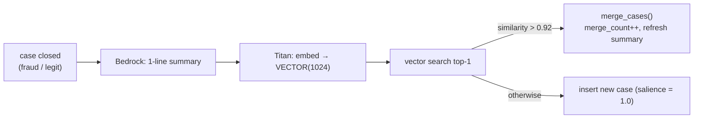
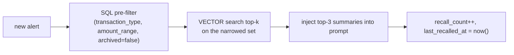

# Agentic Memory

> This is the document the "Agentic Memory Design" scoring criterion is about. The claim: CockroachDB is used as a **production-grade memory substrate**, not a toy query.

HiveMind gives the fleet three kinds of memory, each with a distinct job, distinct access pattern, and distinct lifecycle — all in one database.

| Tier | Table | Nature | Lifespan |
|------|-------|--------|----------|
| **Working** | `tasks` | Transactional, mutable, per-investigation | Seconds–minutes (until the case closes) |
| **Episodic** | `case_memory` | Vector + text, shared across the whole fleet | Days–weeks, decayed by salience |
| **Audit** | `audit_log` | Append-only, immutable | Forever (compliance) |

## Episodic memory — the part that learns

An LLM is born amnesiac: every Bedrock call starts from a blank page. Episodic memory turns the *cost* of one investigation into an *asset* the whole fleet reuses. It has two independent lifecycles (a separation drawn straight from the agent-memory literature — construction cost ≠ query cost).

### Construction (asynchronous, after a case closes)



Consolidation means the memory table doesn't bloat with near-duplicates: the tenth "TRANSFER that drains the origin to zero" **strengthens** one memory (higher `merge_count`, higher effective salience) instead of adding a tenth row. This is deduplication *by meaning*, powered by the vector index.

### Query (synchronous, during a new investigation)



The context window stays small and bounded — **system prompt + top-3 case summaries + the current alert**, never a dump of history. Recalling a memory also *reinforces* it (`recall_count++`), so memories that keep proving useful resist decay. This is retrieval-induced strengthening: the fleet's memory adapts to what actually recurs.

### Forgetting (background, every 6 hours — `salience-decay` Lambda)

```sql
-- age down memories that haven't helped recently
UPDATE case_memory SET salience = salience * 0.95
WHERE archived = false AND last_recalled_at < now() - INTERVAL '7 days';

-- archive the truly forgotten (excluded from the vector index predicate)
UPDATE case_memory SET archived = true
WHERE archived = false AND salience < 0.10;
```

Because the vector index is defined `WHERE archived = false`, archiving doesn't just hide a memory — it **removes it from the search space**, so recall stays fast as the corpus grows. Salience is bounded `[0.0, 2.0]` by a CHECK constraint, so reinforcement can't run away.

## Working memory — the part that survives crashes

`tasks` is durable working memory. The investigation's progress (`step`, `scratchpad` JSONB) is committed to the database at each step, not held in a worker's RAM. Consequences:

- Kill an agent mid-case → the Heartbeat Reaper re-queues the task in ≤30s → another worker reads `scratchpad` and **resumes at the same step**. From the outside, a crash is a non-event.
- `SELECT … FOR UPDATE SKIP LOCKED` lets 20+ workers poll the same table with zero coordination and zero double-claims.
- `UNIQUE(transaction_id)` guarantees a single transaction is never investigated twice, even under a thundering-herd of dispatchers.

## Audit memory — the part with legal weight

Every action, with its reasoning, token cost, latency, and (for escalations) the human reviewer, is appended to `audit_log`. This is memory as *evidence*: a regulator's "why did you block this customer?" is answered by one SQL query, and the answer includes the human who signed off. Append-only + foreign-keyed + strongly consistent = an audit trail that can't silently lose a row.

## Why this is production-grade (not a toy)

| Toy usage | HiveMind |
|-----------|----------|
| One table, dump everything in | Three tiers, each with its own access pattern and lifecycle |
| Vector search over everything | Vector index **partial on `archived=false`**, pre-filtered by cheap SQL predicates first |
| Memory grows unbounded | Consolidation (merge > 0.92) + salience decay + archiving keep it bounded and fast |
| Single-region, best-effort | Multi-region consensus, **RPO = 0** for the audit and working tiers |
| "It remembers" as a demo trick | Recall reinforcement + forgetting = a corpus that *adapts* to recurring fraud |

## The three CockroachDB capabilities used, and where

1. **Distributed vector index** — `case_memory.embedding VECTOR(1024)`, `vector_l2_ops`, partial on live memories. The heart of episodic recall.
2. **MCP Server** — three read-only tools the agent calls to explore customer context safely (see [Security](SECURITY.md)).
3. **Multi-region, strongly-consistent SQL** — `SKIP LOCKED` coordination, foreign-keyed audit, RPO-0 region survival.

Two would satisfy the contest minimum; HiveMind uses all three because each maps to a real requirement of running an agent fleet, not to a checkbox. The rationale is recorded in [ADR-0001](adr/0001-cockroachdb-as-agentic-memory.md).

## Human-taught memories

The fleet has two sources of episodic memory, and they flow through the same
consolidation pipeline:

1. **Self-learned** — every case the agent decides is summarised, embedded and
   merged into `case_memory` (the ~34:1 distillation described above).
2. **Human-taught** — when a reviewer decides an escalated case (Review Queue
   approve/reject) or an operator overrides a verdict (Transactions page), that
   decision is embedded and written into the same table with
   `key_signals = ['human_reviewed']`, confidence 1.0, and **salience pinned at
   2.0** — the ceiling salience decay cannot cross. The fleet can forget its own
   inferences; it never forgets what a human taught it.

The next investigation of a similar transaction recalls the human's decision
through the exact same vector search as any other memory. Nothing about the
recall path knows or cares that the teacher was human — which is the point:
one memory, two teachers.

Count them live:

```sql
SELECT COUNT(*) FROM case_memory WHERE 'human_reviewed' = ANY(key_signals);
```
