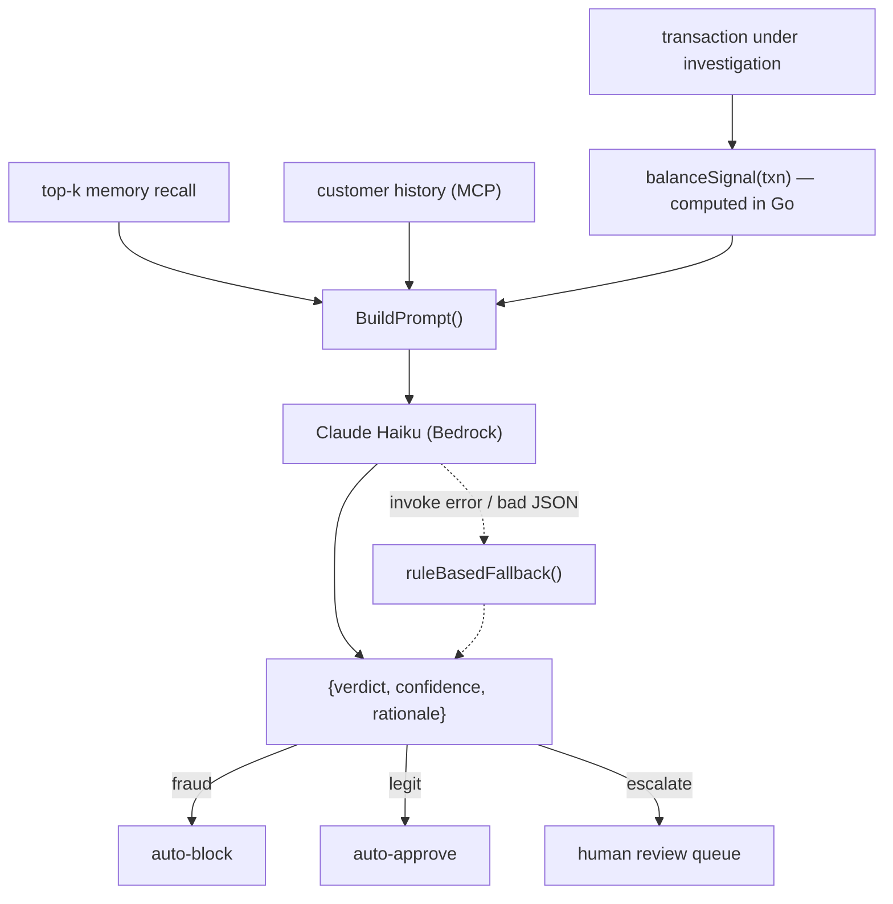

# Agent Reasoning

> How a **small, cheap** LLM (Claude Haiku) reaches a correct fraud verdict — and why the design, not the model size, is what makes it correct. This is the "Creativity & Originality" story.

## The problem with asking a small model to do arithmetic

The naive prompt hands Claude the raw balances and asks "is this fraud?". Small models are weak at multi-step numeric reasoning: they misjudge whether `old_balance_orig − amount ≈ 0`, whether the destination was credited, and so on. Four prompt-only iterations plateaued — the model *reasoned about numbers* and got them wrong.

## The insight: do the arithmetic in Go, let the model reason over a *category*

The exact arithmetic is trivial and deterministic — so we compute it in code, and hand the model a **categorical signal** it *is* good at reasoning over. This is the `balanceSignal` tool ([`internal/agent/reasoning.go`](../internal/agent/reasoning.go)):

```go
func balanceSignal(txn *mcp.Transaction) string {
    drained := math.Abs(txn.OldBalanceOrig-txn.Amount) < 1.0 && txn.NewBalanceOrig < 1.0
    destCredited := txn.NewBalanceDest >= txn.OldBalanceDest+txn.Amount-1.0
    switch {
    case drained && !destCredited:
        return "DRAIN -- the origin held almost exactly the amount and was emptied to zero, " +
            "and the destination balance did not rise to receive it. The money left the origin and vanished."
    case destCredited:
        return "FUNDS MOVED -- the destination balance rose by about the amount; the money genuinely arrived."
    default:
        return "INCONCLUSIVE -- the balances match neither a clean account drain nor a completed transfer."
    }
}
```

The prompt then gives the model a crisp mapping and tells it the tool's finding is the **primary evidence**:

```
finding starts with DRAIN        -> account-drain fraud signature. verdict = fraud.
finding starts with FUNDS MOVED  -> the money genuinely arrived.   verdict = legit.
finding starts with INCONCLUSIVE -> you cannot confirm the path.   verdict = escalate.
```

The model still reads the memory hits and customer history and may override on strong contrary signals — but it is no longer asked to be a calculator. It's asked to be a *judge*, which is what LLMs are good at.

## Why the DRAIN signature is the right discriminator

PaySim's fraudulent `TRANSFER`/`CASH_OUT` rows share a fingerprint: the origin held almost exactly the amount and was zeroed, while the destination balance did not rise to receive it — the money left and vanished. On the labelled eval this signature is a clean separator:

| Set | Cases | DRAIN fires | 
|-----|-------|-------------|
| Fraud | 34 | 34 (100% recall) |
| Legit | 340 | 0 (0 false positives → 100% precision) |

The `< 1.0` tolerances absorb floating-point noise; the destination-credit check distinguishes a genuine transfer (money arrived) from a drain (money vanished).

## Decision flow



## Safety nets

- **Input sanitisation before the prompt.** `name_orig` / `name_dest` come from an external feed and are sanitised (`SanitizeField`) to strip prompt-injection characters before interpolation — numeric fields are typed, never string-concatenated. See [Security](SECURITY.md).
- **Deterministic fallback.** If Bedrock errors, returns empty content, or emits unparseable/invalid JSON, `ruleBasedFallback` produces a verdict from the risk score alone (`≥0.80 → fraud`, `≥0.50 → escalate`, else `legit`). The fleet degrades, it doesn't stall — and the audit row records `step = "fallback"` so the downgrade is visible.
- **Verdict whitelist.** Only `fraud | legit | escalate` are accepted; anything else triggers the fallback. The model cannot invent a verdict.
- **Audit honesty.** `bedrock_model` is written only when a model was actually invoked (`step == "bedrock_reasoning"`), so a fallback verdict never masquerades as a model decision.

## Cost & escalation profile (measured on the demo eval)

| Metric | Value |
|--------|-------|
| Recall / precision on labelled eval | 100% / 100% |
| Auto-resolved without a human (fraud + legit) | ~46% |
| Escalated to human review | remainder |
| Cost per full investigation run (Haiku + Titan) | ~$0.09 |

Escalation is deliberately reserved for the `escalate` verdict — the case the *agent itself* flagged as uncertain — so humans are spent only where they add value, keeping the "reduces investigation time" promise honest. The methodology is reproducible: see [`test/`](../test/).
