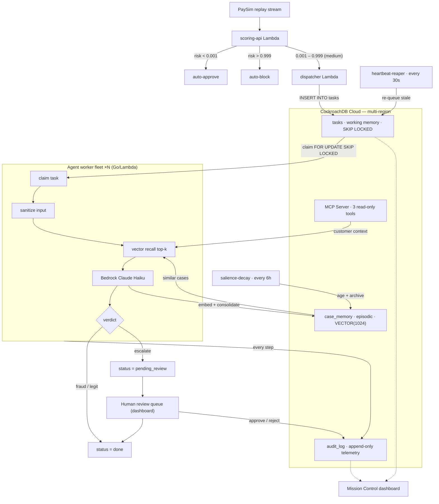
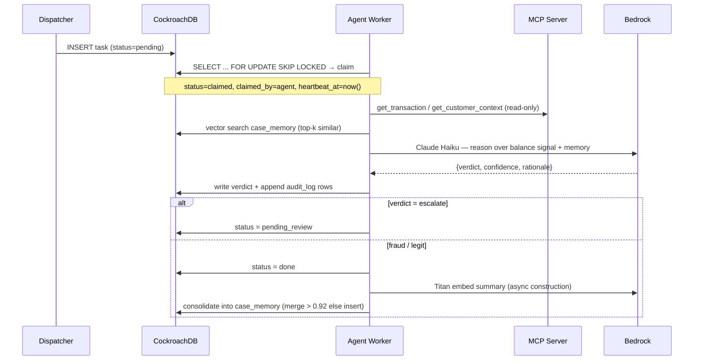

# Architecture

HiveMind is a **fleet of stateless Lambda workers** coordinating through **one strongly-consistent database**. No worker holds durable state in memory; everything that must survive a crash lives in CockroachDB. That single decision is what lets an agent be killed mid-investigation and have another pick up exactly where it left off.

## Components

| Component | Binary (`cmd/`) | Runtime | Responsibility |
|-----------|-----------------|---------|----------------|
| **Scoring API** | `scoring-api` | Lambda (Function URL) | Scores an incoming transaction; routes low→auto-approve, high→auto-block, medium→investigate. |
| **Dispatcher** | `dispatcher` | Lambda (EventBridge + on-demand) | Reads medium-risk transactions, writes one `tasks` row each (working memory), invokes the worker fleet. |
| **Agent Worker** | `worker` | Lambda ×N | Claims a task (`SKIP LOCKED`), validates input, recalls memory, calls Bedrock, writes a verdict + full audit trail. |
| **Heartbeat Reaper** | `heartbeat-reaper` | Lambda (EventBridge, 30s) | Re-queues tasks whose `heartbeat_at` has gone stale — a crashed agent's work returns to the pool. |
| **Salience Decay** | `salience-decay` | Lambda (EventBridge, 6h) | Ages unused memories down and archives the forgotten ones (GEM-style forgetting). |
| **Dashboard API** | `dashboard-api` | Lambda (Function URL) | Read endpoints for the UI + the **control plane** (fleet/dispatch/feed/db/query). |
| **Review CLI** | `review` | CLI | Operator tool for the human-in-the-loop review queue. |

All state lives in **CockroachDB Cloud**; reasoning and embeddings come from **Amazon Bedrock**; schedules are **EventBridge** rules; the operator UI is a **Next.js static site** on **S3 + CloudFront**.

## End-to-end flow

## The investigation lifecycle (one task)

Each arrow that touches `audit_log` writes exactly one append-only row (`mcp_query`, `memory_recall`, `bedrock_reasoning`, `verdict_*`, …) with tokens and latency, so a single `SELECT ... WHERE task_id = $1 ORDER BY created_at` replays the entire decision.

## Resilience model

Three independent failure modes, three mechanisms — all resolved in the database, none needing an external coordinator:

| Failure | Mechanism | Guarantee |
|---------|-----------|-----------|
| **Two agents grab the same task** | `SELECT … FOR UPDATE SKIP LOCKED` on the claim | Exactly-once claim; `tasks.transaction_id` is `UNIQUE`, so a transaction can never be held twice. |
| **An agent crashes mid-investigation** | `heartbeat_at` + Heartbeat Reaper (30s) | Stale task re-queues; a new worker reads `step` + `scratchpad` (JSONB) and **resumes at the same step**, not from scratch. |
| **A whole region goes down** | CockroachDB multi-region consensus | Writes continue on the surviving regions with **RPO = 0**; no audit gap, no lost verdict. |

## Why the boundaries are where they are

- **Scoring vs. investigation are separate services.** Scoring is a cheap classifier that sweeps every transaction; investigation is an expensive agent that only runs on the ~2% the classifier can't clear. Splitting them keeps cost bounded. See [ADR-0003](adr/0003-lambda-fleet-and-skip-locked.md).
- **Reads go through MCP, writes go through the SQL driver.** The agent's *exploration* of customer data is read-only by construction (the MCP server exposes only `SELECT`), while state mutations use the typed `pgx` driver. Least-privilege at the protocol layer. See [Security](SECURITY.md).
- **The dashboard is static.** No server to attack or scale; it talks only to the `dashboard-api` Lambda over a Function URL. The control plane is one small, IAM-scoped surface. See [API](API.md).
