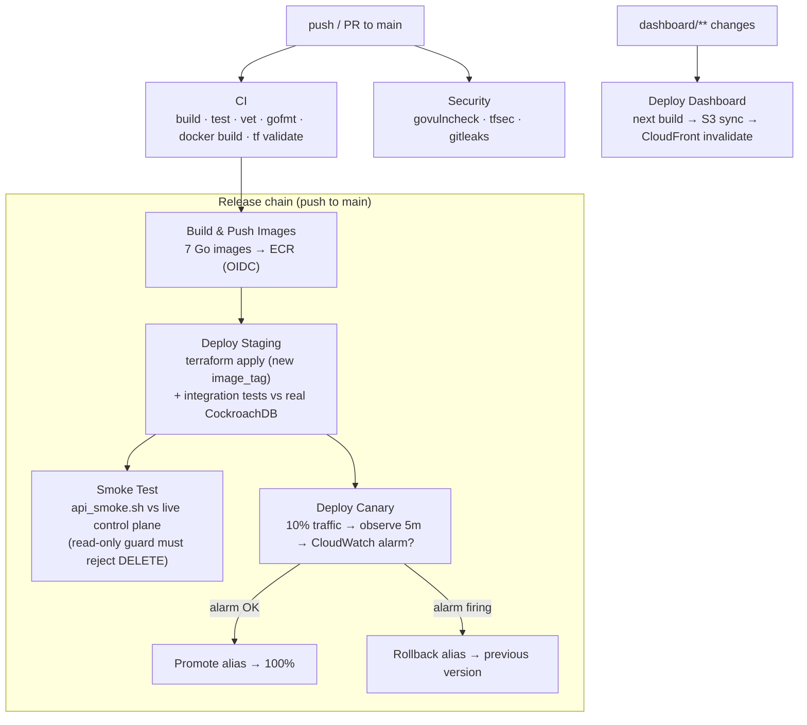

# CI/CD & DevOps

HiveMind ships through a full GitHub Actions pipeline: **verify → build → stage → smoke → canary → promote/rollback**, plus continuous delivery for the dashboard and independent security scanning. Every AWS action uses **OIDC** — there are no long-lived AWS keys in GitHub.

## The pipeline



## Workflows

| Workflow | Trigger | What it does |
|----------|---------|--------------|
| `ci.yml` | push / PR | `go build`, `go test ./...`, `go vet`, `gofmt -l`, Python syntax/import, **Docker build of all 7 images**, `terraform validate` + `fmt -check`. |
| `security.yml` | push / PR / weekly | **govulncheck** (Go CVEs), **tfsec** (IaC misconfig), **gitleaks** (committed secrets). |
| `terraform-infra.yml` | PR on `terraform/**` / dispatch | `terraform plan` commented on the PR; `apply` only via manual dispatch. |
| `build-and-push.yml` | push to main | Builds & pushes the 7 service images to ECR, tagged with the commit SHA + `latest`, via OIDC. |
| `deploy-staging.yml` | after Build & Push | `terraform apply` with the new `image_tag`, then **integration tests against the real CockroachDB** (`-tags=integration`). |
| `smoke-test.yml` | after Deploy Staging | Runs `test/integration/api_smoke.sh` against the deployed control plane — fails the pipeline if any endpoint is unhealthy or the read-only guard lets a mutation through. |
| `deploy-canary.yml` | after Deploy Staging | Shifts **10%** of `live`-alias traffic to the new version, waits 5 min, checks the per-service CloudWatch error alarm, then **promotes to 100% or auto-rolls-back**. Scheduled services promote directly. |
| `deploy-dashboard.yml` | `dashboard/**` change / dispatch | Builds the Next.js static export with the live API URL, syncs to S3, invalidates CloudFront — CD for the public demo URL. |

## How the canary decides (auto-rollback)

Lambda **weighted alias routing** is the mechanism — no external tool:

1. Publish a new version (staging `terraform apply` does this).
2. Point `live` at the *old* version but route `AdditionalVersionWeights = { new = 0.10 }` → 10% of traffic hits the new code.
3. Wait 5 minutes, then read the `<project>-<env>-<service>-errors` CloudWatch alarm.
4. **Alarm OK →** move `live` fully to the new version, clear the weights.
   **Alarm firing →** move `live` back to the old version and **fail the job** (visible red).

This makes "auto rollback" a real, observable behaviour, not a slide.

## Security model

- **OIDC, no static keys.** GitHub Actions assumes `…-github-actions` via `sts:AssumeRoleWithWebIdentity`, trust-scoped to `repo:lethingochan27925/hivemind:*`.
- **Least-privilege deploy role.** ECR push/pull, Lambda code/alias/version on `<project>-<env>-*` only, CloudWatch alarm read, S3 for the dashboard bucket + Terraform state, CloudFront invalidation. No blanket admin.
- **Secrets in GitHub Secrets → Terraform vars → SSM**, never in the repo. `gitleaks` guards against accidental commits; `.gitignore` blocks `*.tfstate`, `*.tfvars`, `.env*`, and the raw PaySim CSV.

## What each environment secret is

| Secret | Used by |
|--------|---------|
| `AWS_GITHUB_ACTIONS_ROLE_ARN` | every AWS-touching job (OIDC role) |
| `DATABASE_URL` | staging integration tests + `terraform apply` |
| `COCKROACHDB_MCP_ENDPOINT` / `_API_KEY` / `_CLUSTER_ID` | `terraform apply` (wired into SSM) |
| `ALERT_EMAIL` | monitoring SNS subscription |

## Local parity

Everything the pipeline does can be run locally, which is how it was developed:

```bash
go test ./...                                   # same as CI
scripts/build-images.sh                         # same images CI pushes
./scripts/init.sh                               # terraform apply + publish + alias
bash test/integration/api_smoke.sh "$(terraform -chdir=terraform output -raw dashboard_api_url)"
```
