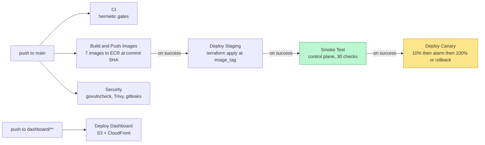
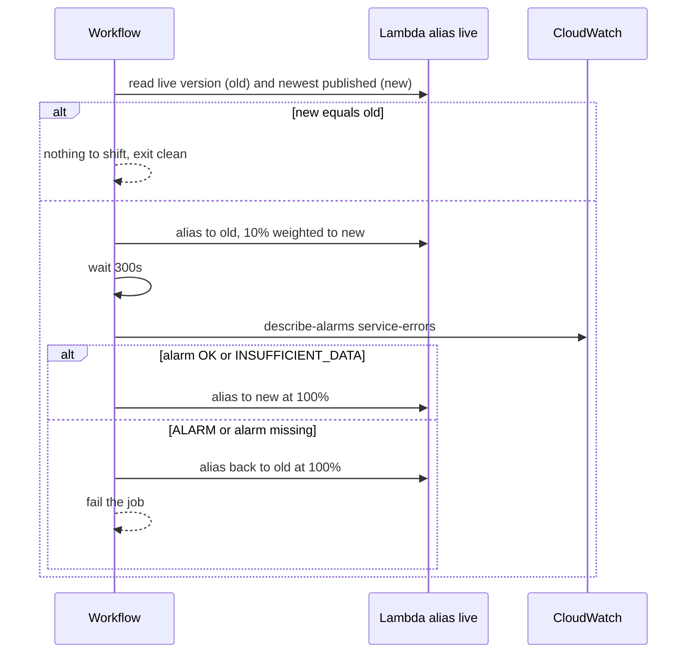

# CI/CD

Eight workflows in `.github/workflows/`. Authentication to AWS is OIDC only —
there is no static AWS key anywhere in the repository, and `pipeline_test.sh`
fails the build if one appears.

## The delivery chain



The ordering matters and used to be wrong. Smoke Test and Deploy Canary both
triggered on *Deploy Staging*, which meant they ran **in parallel** — traffic
could shift to a new version while the smoke test was still running, and a smoke
failure stopped nothing. Deploy Canary now triggers on *Smoke Test*, so a broken
control plane blocks the traffic shift.

Each `workflow_run` consumer checks out `github.event.workflow_run.head_sha`, not
whatever `main` points at when the job starts. Without that pin, a push landing
during a five-minute image build would make Terraform apply a different tree than
the one whose images are in ECR.

## Workflows

| Workflow | Trigger | Purpose |
|---|---|---|
| `ci.yml` | push, PR | Go build/vet/fmt/test, dashboard lint + build, Python service, 7 image builds, Terraform validate, actionlint, pipeline invariants |
| `security.yml` | push, PR, weekly | `govulncheck`, Trivy IaC scan, `gitleaks`, secret hygiene assertions |
| `build-and-push.yml` | push to main | Builds all seven images and pushes them to ECR tagged with the commit SHA |
| `deploy-staging.yml` | after Build and Push | Secret preflight, `terraform apply` with that image tag, integration tests against CockroachDB |
| `smoke-test.yml` | after Deploy Staging | Runs `test/integration/api_smoke.sh` against the live control plane |
| `deploy-canary.yml` | after Smoke Test | Weighted alias canary with alarm-driven promote or rollback |
| `deploy-dashboard.yml` | push to `dashboard/**` | Static export with the live API URL baked in, S3 sync, CloudFront invalidation |
| `terraform-infra.yml` | PR touching `terraform/**`, manual | Plan commented on the PR; apply only on manual dispatch |

## The canary



Three details are deliberate:

- **`$LATEST` is filtered out** before picking the newest version.
  `to_number("$LATEST")` returns null and `max_by` then errors — an intermittent
  failure that looked random.
- **A missing alarm fails.** Treating "the alarm does not exist" as healthy would
  let a canary promote with no supervision at all.
- **`INSUFFICIENT_DATA` promotes.** For an error-count alarm on a low-traffic
  function that is the normal resting state: it means no error datapoints were
  published, not that the check was inconclusive.

## Secrets

Six repository secrets. `deploy-staging.yml` preflights all of them and names the
missing one instead of letting Terraform fail deep in a plan; only the character
count is ever printed.

| Secret | Used by |
|---|---|
| `AWS_GITHUB_ACTIONS_ROLE_ARN` | every workflow that touches AWS |
| `DATABASE_URL` | Terraform, integration tests |
| `COCKROACHDB_MCP_ENDPOINT` | Terraform |
| `COCKROACHDB_MCP_API_KEY` | Terraform |
| `COCKROACHDB_CLUSTER_ID` | Terraform |
| `ALERT_EMAIL` | Terraform (CloudWatch alarm subscription) |

Guarantees enforced by tests rather than by convention:

- no workflow echoes a secret, and none is interpolated into a `github-script`
  body — `${{ }}` there is substituted before the JavaScript is parsed, so an
  interpolated value executes as code; the Terraform plan comment reads from
  `env` instead;
- no `pull_request_target`, and `terraform-infra.yml` skips fork pull requests,
  which cannot mint an OIDC token anyway;
- every referenced secret is documented here, and every documented secret is
  actually referenced — an unused secret is a credential nobody rotates.

## Concurrency and bounds

Every job declares `timeout-minutes`. Every workflow declares `permissions`
explicitly rather than inheriting the repository default.

Deploy workflows use `cancel-in-progress: false`: a cancelled `terraform apply`
leaves partially-applied state, and a cancelled `s3 sync --delete` leaves a site
with assets deleted but not replaced. CI uses `cancel-in-progress: true`, because
superseding a read-only check costs nothing.

## Running the gates locally

```bash
make ci-local     # everything CI runs, on your machine
make cicd         # just the 107 pipeline invariants
make actionlint   # just the workflow linter
make runs         # recent GitHub Actions results
make why          # logs of the most recent failure
```

## Known failure modes and where they surface

| Symptom | Cause | Caught by |
|---|---|---|
| Deploy dies in ~15s on `terraform init` | CLI older than the backend syntax | CICD-02, CICD-04 |
| Every control-plane request returns 502 | duplicate route panics at Lambda init | `go test ./cmd/...`, smoke gate |
| Dashboard renders but every panel says "Failed to fetch" | API URL not baked into the bundle | deploy-dashboard verification step |
| `update-function-code` rejects the image | buildx wrote an OCI index | CICD-29 |
| Canary fails intermittently with a jmespath error | `$LATEST` in `to_number` | CICD-33 |
