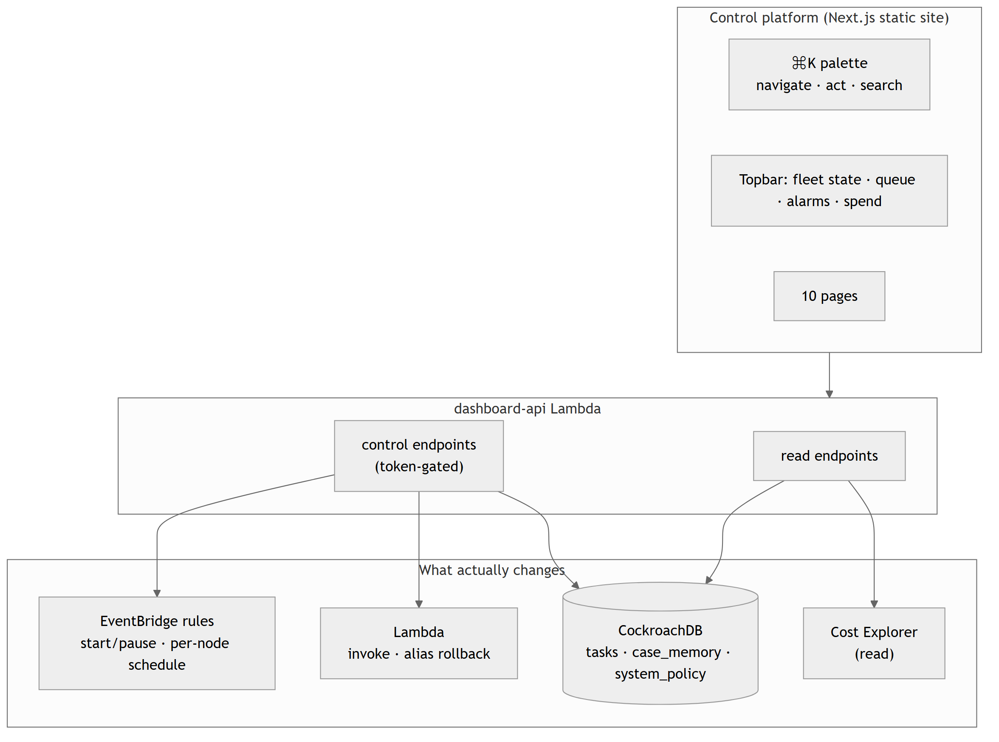
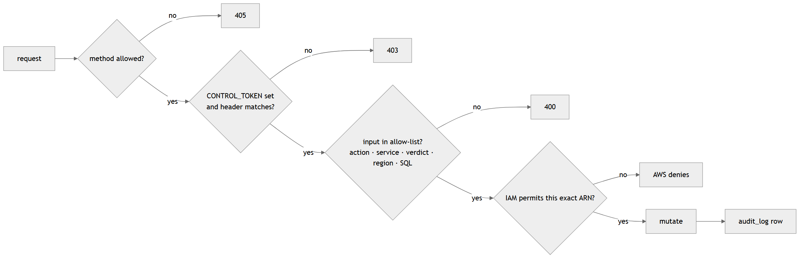

# Control Plane

The dashboard is not a viewer. Every page can **change the running system**, and this document is the map of what can be changed, by whom, and what stops a mistake from becoming an incident.

  

## The surfaces

### Mission Control — run the fleet

| Control | Effect |
|---------|--------|
| Start / Pause fleet | Enables or disables all four EventBridge schedules |
| Run dispatch cycle | Invokes the dispatcher synchronously and reports tasks created / workers invoked |
| Feed N cases | Re-queues N closed transactions into the stream (demo replay) |
| **Agent policy** | Writes `system_policy`; the agent re-reads it **every task** (15s cache) |

**Agent policy** is the piece that makes the platform more than buttons:

| Parameter | Meaning | Guard |
|-----------|---------|-------|
| `risk_low` | below this, auto-approve without an agent call | `0 ≤ low < high ≤ 1` |
| `risk_high` | above this, auto-block without an agent call | same |
| `dispatch_batch` | workers fanned out per dispatch | 1–200 |
| `fallback_action` | when Bedrock is unavailable: `escalate` to a human, or `requeue` to retry later | allow-list |
| `daily_budget_usd` + `auto_pause_on_budget` | daily Bedrock cap and whether crossing it pauses the fleet | 0–1000 |

`fallback_action = requeue` exists because of a real incident: under Bedrock throttling the agent fell back to a rule-based verdict and escalated in bulk, flooding the review queue with cases that were never actually ambiguous. Re-queueing puts the work back where it belongs — the fleet — instead of on a person.

### Review Queue — human-in-the-loop, at scale

Approve or reject one case, or select many and decide in bulk (`≤500` per call, reviewer name required — an anonymous mass approval is rejected). **Send back to agent** returns a case to the queue instead of forcing a human verdict. Every decision writes a `human_reviewed` audit row with the reviewer's name — and, single or bulk, is also embedded and pinned into `case_memory` (see [Agentic Memory § Human-taught memories](AGENTIC_MEMORY.md#human-taught-memories)), so the correction outlives the audit row: the next similar case recalls it. Both the free-text notes and the reviewer's own name are sanitised before that embedding happens — see [Security](SECURITY.md#prompt-injection-defence).

### Training Lab — the memory experiment, interactive

Feed a batch, drain the queue through the live fleet, measure — repeat. Each batch reports memory formation (active/archived memories, raw cases absorbed), decision mix (auto-resolved vs escalated) and cost, and every run is saved to CockroachDB for comparison. The server returns only cumulative snapshots; the browser diffs consecutive reads, so no session state lives outside the database and every number traces back to `audit_log`. **Honesty built in:** HiveMind does not fine-tune model weights — Bedrock doesn't expose that — so what this page measures forming, batch by batch, is episodic memory, not a retrained model.

### Transactions — act on a single case

The **Decision trace** shows the anatomy of a verdict: task claimed → memories recalled (with real vector similarity per hit) → MCP customer context → Bedrock reasoning (model, tokens, latency) → verdict, including any crash and resume. From the same panel: **Re-investigate** (hand the case back to the fleet) or **Override** the verdict with your name attached.

### Fleet & Memory — administer what the fleet remembers

Pin (salience 2.0, immune to decay), archive (out of the partial vector index), restore, delete, plus **Run decay** — which invokes the real `salience-decay` Lambda rather than an inline copy of its SQL, so the console exercises the same code path the scheduler does.

### Cost — token spend, cloud spend, and a guardrail that acts

Bedrock token cost per agent, **AWS Cost Explorer month-to-date by service** (cached 6h server-side because Cost Explorer bills per query), and the daily cap. With auto-pause armed, crossing the cap disables the schedules — the control plane checks on each poll of `/control/budget`. The per-token unit price is **live**, not hardcoded: `internal/pricing` asks the AWS Pricing API for the current Claude Haiku rate (cached 12h) and the response is labelled with where the number came from — `aws-pricing-api` (both directions live), `hybrid` (one direction live, the other backfilled from the published list price — the real state of the Bedrock catalog, which lists an input SKU for Claude 3 Haiku but no output SKU), or `static` (Pricing API unreachable, published list price only, cached just 5 minutes so a transient failure doesn't pin a stale label). `internal/budget` — the guardrail that actually pauses the fleet — and the dashboard's displayed price always read from the same one constant, so the two can never quietly disagree about what a token costs.

### Pipeline — delivery

Live GitHub Actions state for the release chain (CI → build → staging → smoke → canary) plus independent lanes, and **manual rollback**: move a function's `live` alias to the previous published version. It refuses when there is no earlier version rather than silently pointing at `$LATEST`. The dashboard doesn't call `api.github.com` directly — every viewer's request goes through a `dashboard-api` proxy (30s shared cache, optional `GITHUB_TOKEN`) so a room full of people watching the same demo shares one upstream rate-limit budget instead of exhausting the public 60/hour limit from one office IP.

### Database — read-only SQL console

Presets and free-form SQL, capped at 200 rows, CSV export client-side. The guard is described in [Security](SECURITY.md): statements must start `SELECT`/`SHOW`/`WITH`, be a single statement, and contain no mutating keyword — with a read-scoped database role underneath.

### Architecture — the map is the menu

The topology is generated from `/control/lambdas`, `/control/db` and `/control/resources`. Every node is a link into the control surface for that thing: a Lambda opens its node detail, S3/EventBridge/SSM/ECR/SNS/DynamoDB open that group in the inventory, CockroachDB opens the Database console, Bedrock opens Cost.

### Infrastructure — nodes, inventory, chaos, regions

One table for the fleet (state · alarm · schedule · version · memory · timeout), a per-node detail with **enable/disable schedule**, **Run now**, **rollback** and a logs link, the full tagged AWS inventory grouped by service with console links, the **chaos button** with its live recovery tracker, and **multi-region** controls for the database tier.

## Safety model

  

Four layers, in order:

1. **Method** — mutations are POST-only.
2. **Token** — `CONTROL_TOKEN` gates every mutating endpoint when set (open in demo mode, and that is stated, not hidden).
3. **Allow-lists, before any I/O** — service names, actions, verdicts, region names (`^[a-z0-9][a-z0-9-]{1,62}$`), SQL prefixes. The tests drive these handlers with a **nil database** so a removed guard panics instead of silently mutating.
4. **IAM** — the control plane's role can toggle `*-schedule` rules, invoke the four fleet functions, read/update aliases on `hivemind-*`, and read Cost Explorer. It cannot delete functions, change code, or touch the data plane.

Everything that changes state lands in `audit_log`, including operator overrides (`agent_id = "control-plane"`).

## What is deliberately *not* here

- **Cluster-tier region provisioning.** The console changes database regions (`ALTER DATABASE … ADD REGION`); adding a region to the CockroachDB *cluster* stays in the Cloud console because it changes billing. `scripts/multi-region.sh` walks both halves.
- **Destructive infrastructure actions.** No delete-function, no drop-table, no terraform destroy from the browser.
- **End-user auth.** The shared token is a gate, not an identity system; SSO/RBAC is a documented roadmap item.
