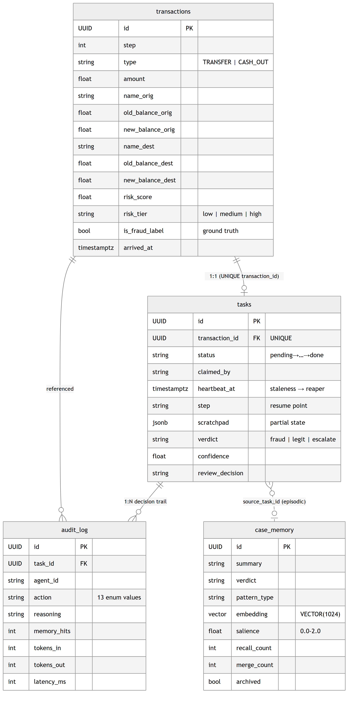

# Data Model

Four tables carry the whole system. The DDL below is **dumped from the live CockroachDB cluster** (`backups/…/schema.sql`), not idealised — every index shown is one the running system actually keeps.

<p align="center">
  
</p>

## `transactions` — the raw event

The immutable PaySim event plus the engineered balance-error fields and the classifier's `risk_score` / `risk_tier`. `is_fraud_label` is the **ground truth** used only for evaluation (never read by the agent).

Indexes worth noting:

- `(risk_tier, arrived_at DESC)` — the dashboard's transaction feed filters by tier, newest first.
- `(name_orig)` / `(name_dest)` — the MCP `get_customer_context` tool joins on `name_orig`; without this index that read is a full scan.
- `USING GIN (name_orig gin_trgm_ops)` / `USING GIN (name_dest gin_trgm_ops)` (`migrations/002_trigram_search_indexes.sql`) — a plain B-tree only accelerates a prefix match, but the ⌘K global search (`internal/dashboardapi/search.go`) runs `ILIKE '%term%'`; CockroachDB's trigram index is the documented mechanism for substring `LIKE`/`ILIKE` ([Trigram Indexes](https://www.cockroachlabs.com/docs/stable/trigram-indexes)).
- `type_check` / `tier_check` constraints — only `TRANSFER`/`CASH_OUT` (the two PaySim types that ever contain fraud) and `low|medium|high` are storable, so bad data can't enter.

## `tasks` — working memory

One row per transaction under investigation. This table **is** the fleet's coordination primitive.

```sql
status IN ('pending','claimed','investigating','done','failed','escalated','pending_review')
```

The lifecycle: `pending → claimed → investigating → done | failed | escalated | pending_review`.

Partial indexes make the hot paths index-only:

| Index | Purpose |
|-------|---------|
| `(status, created_at) WHERE status='pending'` | The claim query — workers scan only pending rows. |
| `(heartbeat_at) WHERE status IN ('claimed','investigating')` | The reaper's staleness sweep touches only in-flight tasks. |
| `(status) WHERE status='pending_review'` | The review queue loads instantly. |
| `(verdict, completed_at DESC) WHERE verdict IS NOT NULL` | Dashboard verdict trends. |
| `UNIQUE (transaction_id)` | **Idempotency** — a transaction can never spawn two tasks. |

`scratchpad JSONB` holds `mcp_result`, `top_k_cases`, `partial_reasoning`, `retry_count` — the crumbs a resuming worker reads after a crash. `step` names the point to resume from.

## `case_memory` — episodic memory (the vector layer)

What the fleet *learns*. Each row is a consolidated case: a natural-language `summary` the agent reads, plus a `VECTOR(1024)` Titan embedding the agent searches.

```sql
embedding   VECTOR(1024)                       -- Titan Embeddings v2, dim locked in the API call
salience    FLOAT NOT NULL DEFAULT 1.0          -- CHECK between 0.0 and 2.0
recall_count INT  NOT NULL DEFAULT 0            -- how often this memory has helped
merge_count  INT  NOT NULL DEFAULT 1            -- how many raw cases consolidated into it
archived     BOOL NOT NULL DEFAULT false        -- forgotten memories excluded from search
```

Indexes:

- **`VECTOR INDEX (embedding vector_l2_ops) WHERE archived = false`** — the distributed vector index. Similarity search runs against *live* memories only; archived ones are physically excluded, so forgetting speeds up recall.
- `(transaction_type, verdict, archived)` and `(pattern_type, verdict) WHERE archived=false` — the statistical pre-filter narrows candidates *before* the vector search (cheap SQL predicate → smaller vector scan).
- `(salience, last_recalled_at) WHERE archived=false` — the decay job finds forgettable memories in index order.

The two lifecycles are covered in depth in [Agentic Memory](AGENTIC_MEMORY.md): **construction** (embed → consolidate on insert, merge above 0.92 similarity) and **query** (embed alert → top-k recall).

## `audit_log` — audit memory (append-only)

Every step every agent takes, forever. Fourteen `action` values span the full trajectory:

```
mcp_query · memory_recall · bedrock_reasoning
verdict_fraud · verdict_legit · verdict_escalate
auto_approve · auto_block
task_claimed · task_resumed · task_failed · task_requeued
human_reviewed · human_lesson_stored
```

The last one is deliberately separate from `human_reviewed`: `human_reviewed` marks the review *decision* (written by the review-decision handlers themselves), `human_lesson_stored` marks that the decision was successfully embedded and pinned into `case_memory` (`internal/dashboardapi/learn.go`) — added in [migration 003](../migrations/003_human_lesson_audit_action.sql) after every insert of that action silently failed `action_ck` since the human-in-the-loop feature was first written (the `case_memory` write itself was never affected — only this secondary audit marker).

Each row carries `reasoning` (natural-language, for compliance), `memory_hits`, `similarity_scores[]`, `tokens_in`/`tokens_out`, `bedrock_model`, and `latency_ms`. Token counts come straight from Bedrock's response body — writing them is mandatory, and `bedrock_model` is only stamped on rows where a model was actually invoked (audit honesty).

**One query = one case's entire decision history, including the human step:**

```sql
SELECT action, reasoning, reviewer_id,
       tokens_in + tokens_out AS total_tokens, latency_ms
FROM audit_log
WHERE task_id = $1
ORDER BY created_at ASC;
```

## Referential integrity

Foreign keys are real and enforced: `tasks.transaction_id → transactions.id`, `audit_log.task_id → tasks.id`, `audit_log.transaction_id → transactions.id`. Because all four tables live in one strongly-consistent database, an audit row can never reference a task that doesn't exist — a guarantee a Redis + Pinecone + Postgres split simply cannot make. See [ADR-0001](adr/0001-cockroachdb-as-agentic-memory.md).
