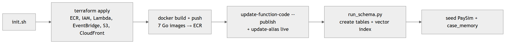

# Deployment Runbook

Reproduce the entire system from zero. The goal (Definition of Done) is that `scripts/init.sh` stands up all infrastructure with no manual clicking.

## Prerequisites

| Tool | Why |
|------|-----|
| AWS account + `aws` CLI (configured) | Lambda, ECR, EventBridge, S3, CloudFront, CloudWatch, SSM |
| **Bedrock model access** enabled | Claude Haiku (`ap-southeast-1`) + Titan Embeddings v2 (`us-east-1`) must be granted in the Bedrock console *before* first run |
| CockroachDB Cloud cluster + `ccloud` CLI | The memory layer; note the connection string and the MCP endpoint/key |
| Terraform ≥ 1.5 | All AWS + wiring |
| Docker | Lambda container images are built and pushed to ECR |
| Go 1.25 · Node 22 | Build the Go binaries and the Next.js dashboard |

## Secrets — SSM Parameter Store (never committed)

The Lambdas read configuration from SSM at cold start (see `internal/config/config.go`). Populate with `scripts/push-secrets.sh`:

| SSM parameter | Contents |
|---------------|----------|
| `.../database_url` | CockroachDB SQL connection string (SecureString) |
| `.../cockroachdb/mcp_api_key` | MCP Server bearer token |
| `.../cockroachdb/mcp_cluster_id` | MCP cluster id |
| `.../claude_model_id`, `.../titan_model_id` | Bedrock model ids |

`terraform.tfvars` and `*.tfstate` hold the same secrets in plaintext — both are `.gitignore`d and must never be pushed (this is why the repo blocks them).

## One-command bring-up

```bash
./scripts/init.sh
```

What it does, in order:

<p align="center">
  
</p>

> **The alias trap.** Lambdas are pinned to the `live` alias with `ignore_changes = [function_version]`. After every image push you must `aws lambda update-function-code … --publish` **then** `aws lambda update-alias … --function-version N` — Terraform alone will not move the alias. `init.sh` handles this; if you push a Lambda by hand, do both steps.

## Dashboard (static site)

```bash
API=$(terraform -chdir=terraform output -raw dashboard_api_url)
printf 'NEXT_PUBLIC_DASHBOARD_API_URL=%s\n' "${API%/}" > dashboard/.env.production.local
(cd dashboard && npm ci && npm run build)          # Next.js static export → dashboard/out
aws s3 sync dashboard/out "s3://$(terraform -chdir=terraform output -raw dashboard_bucket_name)" --delete
aws cloudfront create-invalidation \
  --distribution-id "$(aws cloudfront list-distributions \
     --query "DistributionList.Items[?Comment=='hivemind-dev-dashboard'].Id" --output text)" \
  --paths '/*'
```

> **S3 + OAC returns 403, not 404,** for a missing key, which breaks client-side routes on reload. A CloudFront Function rewrites extensionless URIs to `.html` (`terraform/modules/storage`). Sub-route reloads (`/architecture`, `/database`) work because of it.

## Smoke test after deploy

```bash
API=$(terraform -chdir=terraform output -raw dashboard_api_url)
bash test/integration/api_smoke.sh "$API"      # see test/
```

Expected: `/overview`, `/control/db`, `/control/lambdas` return `200`; a `DELETE` to `/control/query` returns `400`.

## Teardown

```bash
terraform -chdir=terraform destroy
```

CockroachDB Cloud is torn down from its own console / `ccloud`. Set a **billing alert** ($50 AWS, $100 CockroachDB) on day one — multi-region is only enabled at the end for the demo recording to conserve credits.

## Common failure modes (seen and fixed)

| Symptom | Cause | Fix |
|---------|-------|-----|
| `403` on a Function URL | Public URL needs both `lambda:InvokeFunctionUrl` **and** `lambda:InvokeFunction` (Oct-2025 rule) | Both permissions are in `terraform/modules/lambda` |
| `UnrecognizedClientException` from Bedrock | Static creds without a session token | Use the default credential chain (`pkg/bedrock` does) |
| High fallback rate under load | Bedrock throttling from a 20-worker burst | Adaptive retry (`RetryModeAdaptive`, 8 attempts) |
| `500` on `/memory` when agents active | `TIMESTAMPTZ` scanned into a Go `string` | Scan into `time.Time` then format |
