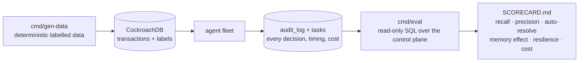

# Evaluation — proving the fleet actually works

Claims are cheap. This page is about the two tools that let anyone — including a judge with nothing but the demo URL — check whether the agent fleet does its job.



## 1. Data you can regenerate

The original PaySim CSV is 470 MB, so it is not in the repository — which would leave anyone who clones the repo unable to reproduce a single number. `cmd/gen-data` closes that gap:

```bash
go run ./cmd/gen-data --count 1000 --fraud-rate 0.09 --seed 42 --out data/raw/generated.csv
go run ./cmd/gen-data --edge-cases --out data/raw/edge.csv
```

- **Same header as PaySim**, so every existing loader and replay script consumes it unchanged.
- **Deterministic**: the same `--seed` produces byte-identical output, so a number in the README can be tied to an exact input.
- **Labelled**: `isFraud` is written from the generator's intent, not inferred, so the scorecard has ground truth.

### The edge set is the interesting half

`--edge-cases` emits ten transactions that each exist to break a naive implementation:

| Case | Why it is hard |
|------|----------------|
| Textbook drain | The baseline: must be caught |
| **Emptied account, destination credited** | A rule that only checks "was the account emptied" flags this as fraud. It is legitimate: the money arrived. |
| Partial drain | Neither a clean drain nor a completed transfer → belongs to a human |
| Balances off by 0.5 | Sits just inside the reconciliation tool's 1.0 tolerance |
| Zero amount | Must not divide by zero or crash |
| 9,999,999,999 amount | No overflow, still classified |
| **SQL + prompt injection in the name fields** | `C7'; DROP TABLE tasks; --` and a forged system message — must reach the model inert |
| Unicode + emoji identifiers | Sanitiser must not corrupt or panic |
| Destination credited *partially* | Money partly vanished |
| Cents left behind | Still an emptied account |

## 2. A scorecard anyone can re-run

```bash
go run ./cmd/eval --api "$(terraform -chdir=terraform output -raw dashboard_api_url)"
go run ./cmd/eval --api https://<public-demo-url> --out evidence/SCORECARD.md --json evidence/scorecard.json
```

`cmd/eval` needs **no AWS credentials and no database password** — it only uses the read-only SQL endpoint of the control plane. That is the whole point: the difference between *"we claim 100%"* and *"run this against our live URL and see 100% yourself"*.

It answers six questions, in order:

| # | Question | How it is measured |
|---|----------|--------------------|
| 1 | Does it judge correctly? | Confusion matrix of `tasks.verdict` against `transactions.is_fraud_label` → recall, precision, F1, accuracy |
| 2 | How much work does it remove? | Auto-resolved share vs escalated |
| 3 | Are the verdicts real reasoning? | Model decisions vs rule-based fallbacks (`bedrock_model IS NULL`) |
| 4 | Does shared memory earn its keep? | Reasoning latency of investigations **with** a recall hit vs **cold** ones; consolidated memories vs raw cases absorbed |
| 5 | Does the fleet survive itself? | Distinct agents, **double claims (must be 0)**, re-queued vs resumed tasks |
| 6 | What did it cost? | Token totals → USD at Haiku pricing |

**It is also a gate, not just a report:** the command exits non-zero if recall drops below 95% or any transaction was claimed twice. That makes it usable in CI, and it means the number in the README cannot quietly rot.

### Honesty built into the metric

Two things the scorecard deliberately separates, because conflating them would flatter the system:

- **Fallback verdicts are counted apart from model decisions.** When Bedrock is unavailable the agent falls back to a risk-score rule; those rows carry a NULL `bedrock_model` and are reported as their own line. A run that was 60% fallback is not a 60% demonstration of an agent.
- **Escalations are not counted as correct answers.** They are reported as work handed to a human, which is what they are.

## 2b. Measured result — and the finding that matters

Run on 2026-08-13, 60 randomly selected cases replayed twice against the live system:

| Phase | memory at start | auto-resolved | escalated | rate | avg memories recalled |
|-------|-----------------|---------------|-----------|------|----------------------|
| A — cold | 0 active | 27 | 33 | **45.0%** | 1.6 |
| B — warm | rebuilt by phase A | 27 | 33 | **45.0%** | 3.0 |

**Difference: 0.0 points — and that is the result we wanted.**

Two questions hide behind "does memory help?":

1. *Does the memory layer function?* Recall went from 1.6 to 3.0 memories per investigation
   after being archived to zero and rebuilt — it works, and it is reused.
2. *Does recalled text change the verdict?* No. Identical inputs produced identical
   decisions — the same 27/33 split — whether the fleet had seen those patterns before or not.

For a fraud system that is the desired property, not a disappointment. Verdicts come from the
deterministic balance-reconciliation tool; the recalled narrative is context, never an
override. A system whose verdicts drifted with whatever text happened to be retrieved would
be impossible to audit, and impossible to defend to a regulator.

Where the memory layer *does* pay, measured in the scorecard:

- **Consolidation:** 68 memories absorbing 3,217 raw cases (~47:1) — merged by meaning, not piled up.
- **Bounded context:** top-3 recall instead of full history keeps cost at **$0.00023 per investigation** (~$0.11 per 500-case run).
- **Auditability:** every recalled memory is written to `audit_log` with its vector similarity, so any verdict can be reconstructed months later.

## 3. Fuzzing

Table tests prove the cases we thought of; the fuzzer looks for the ones we did not.

```bash
go test ./... -run Fuzz                                            # seed corpus, part of the normal suite
go test ./internal/agent/ -fuzz FuzzBalanceSignal -fuzztime 60s    # hunt for new inputs
go test ./internal/agent/ -fuzz FuzzSanitizeField -fuzztime 60s
go test ./pkg/mcp/       -fuzz FuzzTransactionDecode -fuzztime 60s
```

| Target | Invariant under any input |
|--------|---------------------------|
| `FuzzBalanceSignal` | Never panics; always returns exactly one of DRAIN / FUNDS MOVED / INCONCLUSIVE; deterministic. An unmapped signal would break the prompt contract. |
| `FuzzSanitizeField` | No `"` `{` `}` `<` `>` `:` `;` `'` survives; the length bound is respected; never panics. |
| `FuzzParseScratchpad` | Malformed JSON errors rather than panicking — one corrupt row must not take down every worker that claims that task. |
| `FuzzTransactionDecode` / `FuzzRiskScoreString` | Any MCP payload either decodes or errors; `RiskScore()` never returns NaN (which would compare false in every routing branch). |

**A real bug this found:** `SanitizeField(value, maxLen)` sliced with a negative bound and panicked for `maxLen <= 0`. Every current caller passes 64, so it was unreachable in production — but an input-sanitising function that can itself crash a worker is not a defence. Now guarded, with the fuzz target asserting it.

## 4. Suggested run for a submission

```bash
go run ./cmd/gen-data --count 1000 --seed 42 --out data/raw/generated.csv
python scripts/demo-stream.py --mode replay --limit 1000     # or the Feed button in the console
# wait for the queue to drain
go run ./cmd/eval --api "$API" --out evidence/SCORECARD.md --json evidence/scorecard.json
./scripts/capture-evidence.sh --label scored
```

That sequence produces: a regenerable input, a fleet run over it, a scorecard with the headline numbers, and a full evidence snapshot — all timestamped and all reproducible from a clean clone.
