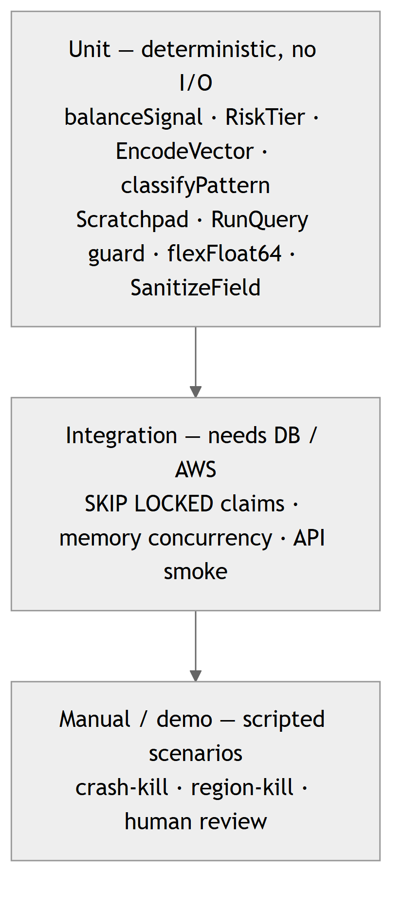

# HiveMind Test Suite

Written from a tester's seat: a documented **test plan**, structured **test cases** traced to the scoring criteria, and **runnable** tests that make every headline claim reproducible. Deterministic tests touch every layer — scoring, memory encoding, agent reasoning, the security guard, crash-resume — and run with no cloud and no database.

```
test/
├── README.md              ← you are here
├── TEST_PLAN.md           ← master QA plan: scope, strategy, entry/exit criteria
├── test-cases/            ← structured, human-readable test cases (the tester deliverable)
│   ├── TC-AGENT.md          agent verdict correctness + prompt-injection resistance
│   ├── TC-MEMORY.md         episodic recall, consolidation, salience decay
│   ├── TC-CONCURRENCY.md    SKIP LOCKED, heartbeat reaper, resume-after-crash
│   ├── TC-CONTROL-PLANE.md  control API + read-only DB console guard
│   ├── TC-DASHBOARD.md      the 10 dashboard pages
│   ├── TC-SCORING.md        risk routing thresholds + auto-decision
│   ├── TC-DATA-INTEGRITY.md schema constraints as a safety net
│   ├── TC-CICD.md           CI/CD pipeline & DevOps invariants
│   ├── TC-CONTROL-OPS.md    policy · memory ops · task control · bulk · budget · rollback · regions
│   └── TC-UX.md             search · i18n · theme · drag-resize · optimistic updates
└── integration/
    ├── reasoning_test.go    runnable Go — balance signal → verdict mapping (no cloud)
    ├── api_smoke.sh         runnable curl — smoke the deployed dashboard-api
    ├── pipeline_test.sh     runnable — assert the CI/CD pipeline invariants (no cloud)
    └── doc.go               makes the dir a normal buildable package
```

## Automated coverage matrix

Every row is a **hermetic** Go test — no network, no DB — so the whole matrix runs on every push in well under a second.

| Under test | Test file | Proves |
|------------|-----------|--------|
| `balanceSignal` | `internal/agent/reasoning_test.go` | DRAIN→fraud, FUNDS MOVED→legit, INCONCLUSIVE→escalate, incl. the "arrived full balance" edge — the 100%/100% discriminator |
| `BuildPrompt` | `test/integration/reasoning_test.go` | the balance finding reaches the model as primary evidence with the verdict contract |
| `SanitizeField` | `internal/agent/validation_test.go`, `test/integration/reasoning_test.go` | prompt-injection payloads are neutralised, length bounded |
| `classifyPattern` | `internal/agent/classify_test.go` | fraud-pattern taxonomy + precedence (balance_wipe > dest_no_update > high_amount > rapid_cashout) |
| `buildCaseSummary` | `internal/agent/classify_test.go` | episodic summary carries type/amount/error fields |
| `ParseScratchpad` / `Encode` | `internal/agent/resume_test.go` | crash-resume serialization round-trips; empty & malformed handled |
| `RiskTier` | `internal/scorer/router_test.go` | routing thresholds + exclusive boundaries (0.001 / 0.999 → medium) |
| `EncodeVector` | `pkg/cockroach/vector_test.go` | []float32 → CockroachDB VECTOR literal, incl. 1024-dim |
| `Transaction` / `flexFloat64` | `pkg/mcp/tools_test.go` | risk_score decodes from number, string, and scientific notation |
| `RunQuery` guard | `internal/dashboardapi/control_test.go` | read-only console rejects every mutating / multi-statement input **before** DB access; honours the control token; 405 on non-POST |
| `parseARN`, naming | `internal/dashboardapi/control_test.go` | inventory ARN parsing + project/env naming convention |
| `AmountRange`, `SignLabel` | `internal/memory/consolidation_test.go` | episodic fingerprint bucketing |
| Policy defaults | `internal/agent/policy_test.go` | missing/unreachable policy falls back to the calibrated thresholds, never to zeros |
| `TaskControl`, `BulkReview`, `MemoryAdmin`, `MemoryJob`, `RollbackService` | `internal/dashboardapi/ops_test.go` | every mutating endpoint rejects bad input **before** touching storage; control-token gate on all of them |
| `alterRegion`, `regionNameRe` | `internal/dashboardapi/regions_test.go` | SQL-injection region names rejected; unknown action refused before any DB round-trip |
| `invokable`, `ScheduleOne`, `InvokeService`, `Search` | `internal/dashboardapi/node_control_test.go` | control plane cannot invoke itself; useless search queries never reach the DB |
| `shortService`, `sortByCostDesc`, `estimateCost` | `internal/dashboardapi/cloudcost_test.go` | cloud-cost parsing/ordering and Haiku pricing maths |
| `cache.TTL` | `internal/cache/ttl_test.go` | fresh-serve, refetch-after-expiry, an error is **never** cached, `ttl<0` results are never cached, a positive `ttl` overrides the default, concurrent misses collapse into one fetch |
| `IsColdStartMiss`, `ShouldWarn` | `pkg/cockroach/errors_test.go` | cold-start (missing table / no row yet) vs a real error are classified correctly, incl. through a wrapped error chain |
| `EncodeVector` (NaN/Inf) | `pkg/cockroach/fuzz_test.go`, `FuzzSQLQuoteLiteral` (`pkg/mcp/fuzz_test.go`) | a non-finite embedding never reaches CockroachDB as a literal NaN/Inf; the SQL escaper never emits an unescaped quote, for any input |
| `MaxConns` env parsing | `pkg/cockroach/client_test.go` | `COCKROACH_MAX_CONNS` overrides the default; an invalid value falls back instead of panicking |
| `config.Load` | `internal/config/config_test.go` | a missing required env returns an error (not a panic); defaults apply; `EMBED_DIM` is validated |
| `DecaySalience`, `RetrieveCaseMemory` recall boost | `internal/memory/salience_test.go`, `salience_integration_test.go` | a pinned memory (salience 2.0) never crosses the archive threshold and the recall boost can never reach the pinned ceiling — the two would be indistinguishable otherwise |
| `LoadPaySim` | `internal/stream/paysim_test.go` | malformed CSV rows are skipped (not zero-filled — a zero balance is itself a fraud signal), non-TRANSFER/CASH_OUT rows are filtered, `limit` is honoured |
| `githubRepo`, `GetPipelineRuns` guard | `internal/dashboardapi/pipeline_test.go` | `GITHUB_REPO` override/default; non-GET rejected before any upstream call |

DB-backed integration tests (`internal/memory/*_integration_test.go`) cover SKIP LOCKED claims and memory concurrency and need `DATABASE_URL`.

## Running

```bash
# 1. Everything hermetic — no AWS, no DB. This is the CI gate.
go test ./...
bash test/integration/pipeline_test.sh      # assert the CI/CD pipeline definitions

# 2. Just the correctness core (verdict discriminator + injection)
go test ./internal/agent/ ./test/integration/ ./internal/scorer/ -v

# 3. Integration against a live deployment
go test ./internal/memory/ -run Integration        # needs DATABASE_URL
bash test/integration/api_smoke.sh "$(terraform -chdir=terraform output -raw dashboard_api_url)"
```

## Test pyramid

<p align="center">
  
</p>

Most assertions live at the bottom (fast, hermetic, run every push). The expensive resilience proofs (crash-kill, region-kill) are scripted manual scenarios in `TEST_PLAN.md` §7 and captured in the `evidence/` clips.
